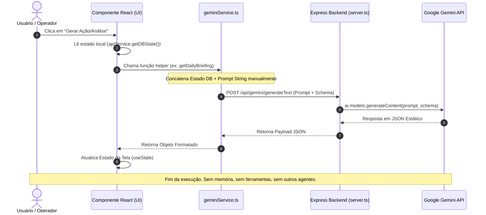
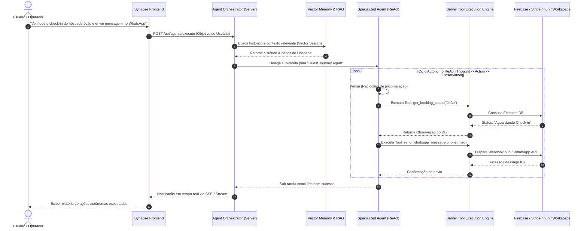

# AI_ARCHITECTURE_ANALYSIS.md: Auditoria Técnica Profunda da Arquitetura de Inteligência Artificial

**Plataforma:** ForestHouse Beach House & Eco-Reserva (Synapse Hospitality PMS, POS, CM & Marketing AI Platform)  
**Data da Auditoria:** 03 de Agosto de 2026  
**Auditor Responsável:** Arquiteto de Software Sênior especializado em Inteligência Artificial, Agentes Autônomos & Google Cloud / Gemini  
**Foco Exclusivo:** Arquitetura de Inteligência Artificial, Modelos, Prompts, Memória, Ferramentas e Orquestração.

---

## Sumário do Documento
1. Quantidade Real de Agentes Atuais
2. Criação dos Agentes
3. Inicialização dos Agentes
4. Armazenamento dos Prompts
5. Definição do Comportamento dos Agentes
6. Comunicação entre Agentes e a API Gemini
7. Montagem do Contexto (Context Building)
8. Histórico de Conversas (Conversation History)
9. Gestão e Tratamento de Memória
10. Comunicação Inter-Agentes (Inter-Agent Communication)
11. Orquestrador de Agentes
12. O Papel Real do Synapse (Coordenador vs. Interface)
13. Agentes com Lógica Própria vs. Telas com Gemini
14. Duplicação de Código entre Agentes
15. Compartilhamento de Ferramentas (Tool Sharing / Function Calling)
16. Acesso a Integrações Externas (Firebase, Google Workspace, Stripe, Aloha Pro, n8n)
17. Avaliação da Arquitetura de Tools
18. Avaliação da Arquitetura de Memória
19. Avaliação da Arquitetura de Prompts
20. Avaliação da Arquitetura de Knowledge (RAG / Base de Conhecimento)
21. Avaliação da Arquitetura de Orquestração
22. Arquitetura Alvo Recomendada (V2 Enterprise Agent Engine)
23. Alterações Necessárias para Agentes Inteligentes Verdadeiros
24. Diagramas Mermaid (Arquitetura Atual vs. Arquitetura Futura)
25. Considerações Finais e Matriz de Maturidade em IA

---

## 1. Quantidade Real de Agentes Atuais

Atualmente, na interface visual e nas especificações de negócio do projeto, são apresentados **12 Agentes Especializados de IA**:
1. **Synapse AI Master Orchestrator** (`SynapseAgentView.tsx`)
2. **Guest Journey AI Agent** (`GuestJourneyAIView.tsx`)
3. **AI Social Engagement Agent** (`AIEngagementAgentView.tsx`)
4. **Marketing Orchestrator Agent** (`MarketingOrchestratorView.tsx`)
5. **AI Strategy Consultant** (`AIStrategyConsultantView.tsx`)
6. **AI Marketing & Growth Lab** (`AIMarketingLabView.tsx`)
7. **AI Team & Task Manager** (`AITeamManagerView.tsx`)
8. **AI Guest Concierge 24/7** (`GuestPortalView.tsx`)
9. **AI Surveillance & Motion Sentinel** (`SurveillanceDashboard.tsx`)
10. **AI Dynamic Price Engine** (`RateManagerView.tsx`)
11. **AI POS & Menu Upsell Agent** (`POSView.tsx`)
12. **AI Housekeeping & Maintenance Agent** (`HousekeepingView.tsx`)

### Realidade Arquitetural Subjacente:
Do ponto de vista de infraestrutura e engenharia de software, **NÃO existem 12 agentes autônomos rodando em background**. 
O projeto possui **1 único serviço de IA** (`/services/geminiService.ts`) que consome o modelo **Google Gemini 2.5/3.0 Flash & Pro** via proxy backend (`server.ts`). As 12 entidades são **interfaces de usuário (views React)** que invocam funções utilitárias estátivas no `geminiService.ts` passando prompts e esquemas JSON específicos para cada contexto visual.

---

## 2. Onde cada Agente é Criado

Nenhum agente é instanciado como uma classe, objeto persistente ou processo de servidor individual.
A "criação" do agente ocorre estaticamente em dois locais:
1. **Frontend (Componentes React):** Cada "agente" é declarado como um componente React de interface na pasta `/components/admin/` (ex: `SynapseAgentView.tsx`, `GuestJourneyAIView.tsx`, `AIMarketingLabView.tsx`).
2. **Camada de Serviço (`services/geminiService.ts`):** Onde estão definidas as funções puras assíncronas que montam a requisição HTTP (ex: `getSynapseCommandResponse`, `generateMarketingPlan`, `generatePersonas`, `getDailyBriefing`).

---

## 3. Onde cada Agente é Inicializado

**Não existe um ciclo de vida de inicialização de agentes (Bootstrap/Daemon).**
Os agentes são "inicializados" **on-demand (sob demanda do usuário)**:
- Quando o usuário clica no menu lateral e navega para a tela do componente (ex: clica em "Guest Journey AI"), o componente React é montado (`useEffect`).
- Quando o usuário clica em um botão na tela (ex: "Analisar Jornada", "Gerar Briefing", "Enviar Mensagem"), o componente React executa a chamada correspondente do `geminiService.ts`.
- Após a resposta da API do Gemini, a função retorna os dados, o componente React atualiza seu estado local (`useState`), e o fluxo de IA é encerrado.

---

## 4. Onde está Armazenado o Prompt de cada Agente

Os prompts **não possuem um repositório centralizado** nem arquivos de template isolados.
Eles estão **hardcoded (incorporados diretamente)** em forma de strings (Template Literals JavaScript) dentro de:
1. **`/services/geminiService.ts`:** Contém a grande maioria dos prompts de diagnóstico, geração de planos, briefings e análises.
2. **Componentes React das Views:** Alguns componentes (como `GuestPortalView.tsx`, `LiveChatWidget.tsx` e `SynapseAgentView.tsx`) possuem prompts concatenados diretamente no próprio código do componente antes de chamar a API de chat.

---

## 5. Definição do Comportamento dos Agentes

Como não há um prompt isolado por arquivo, o comportamento de cada agente é definido pelo encadeamento de três elementos enviados em cada chamada:

1. **System Instruction (Instrução de Sistema):** Uma frase ou parágrafo que define a persona do modelo (ex: *"Você é o especialista de marketing de hospitalidade do hotel ForestHouse..."*).
2. **Prompt de Contexto + Dados:** O estado do banco de dados local (`apiService.getDBState()`) transformado em texto string e concatenado com o pedido do usuário.
3. **Response Schema (Esquema de Resposta JSON):** Um objeto estruturado com a biblioteca `@google/genai` (`Type.OBJECT`, `Type.ARRAY`, `Type.STRING`) que obriga o Gemini a retornar a resposta em um formato rígido parseável pelo TypeScript.

---

## 6. Como cada Agente Conversa com o Gemini

A comunicação segue um fluxo estrito cliente-servidor em duas modalidades:

### Modalidade A: Respostas Estruturadas (JSON Schema)
```
Componente React → geminiService.ts (callGemini) → POST /api/gemini/generateText → server.ts (GoogleGenAI SDK) → API Gemini → Resposta JSON → React State
```

### Modalidade B: Conversação em Texto (Chat Stream/Session)
```
Componente React → geminiService.ts (getChatResponse) → POST /api/gemini/chat → server.ts (ai.models.generateContent / chat.sendMessage) → API Gemini → Resposta em Texto -> React State
```

Em ambos os casos, a comunicação é intermediada pelo backend Express (`server.ts`) para garantir que a chave privada `GEMINI_API_KEY` nunca seja exposta no navegador do cliente.

---

## 7. Montagem do Contexto (Context Building)

O contexto é montado **manualmente no cliente (browser)** antes de cada requisição.

### Fluxo de Montagem:
1. A função do `geminiService.ts` obtém o estado global em memória invocando `apiService.getDBState()`.
2. A função filtra e serializa os arrays desejados (ex: `dbState.bookings`, `dbState.guests`, `dbState.expenses`, `dbState.rooms`).
3. Uma string formatada é construída via interpolação de strings:
   ```typescript
   const prompt = `Analise a situação financeira do hotel ForestHouse:
   - Receita Total: R$ ${totalIncome}
   - Despesas: ${JSON.stringify(expenses)}
   - Reservas Ativas: ${bookings.length}
   
   Pedido do Usuário: ${userQuery}`;
   ```
4. A string resultante é enviada no corpo do JSON da requisição HTTP.

---

## 8. Armazenamento do Histórico de Conversa

O histórico de conversas é tratado de duas formas:

1. **Estado em Memória do React (Padrão):** O histórico fica armazenado no estado local do componente (`const [messages, setMessages] = useState<ChatMessage[]>([])`). Se o usuário recarregar a página ou mudar de aba, o histórico é perdido.
2. **Coleção Firestore (`chatConversations`):** Para o chat de suporte ao cliente e atendimentos de recepção, as mensagens são persistidas no Firestore através da chamada `apiService.saveChatConversation()`. No entanto, esse histórico do Firestore é usado para exibição de registros e **não é re-injetado automaticamente** como contexto na API do Gemini.

---

## 9. Tratamento de Memória

A arquitetura atual possui uma abordagem de memória **Stateless per Request (Sem Memória de Longo Prazo)**.

- **Curto Prazo:** A memória de curto prazo dura apenas enquanto a sessão da tela está aberta, enviando o array completo de mensagens passadas a cada nova requisição.
- **Longo Prazo:** Não há vetores, embeddings ou bancos de memória histórica para lembrar preferências passadas do usuário ou aprendizados de atendimentos anteriores.
- **Janela de Contexto:** Como o contexto inteiro é reenviado em toda requisição, se o histórico crescer demasiadamente, o consumo de tokens aumenta linearmente.

---

## 10. Comunicação Inter-Agentes (Inter-Agent Communication)

**Atualmente, os agentes NÃO conversam entre si.**

Cada "agente" opera em um silo isolado em sua respectiva tela. Por exemplo:
- O *Guest Journey AI* não consegue avisar autonomamente o *AI Team Manager* para agendar uma camareira quando detecta que um hóspede solicitou check-in antecipado.
- O *Marketing Orchestrator* não consegue disparar uma ação direta no *AIEngagementAgent*.

Todas as interações exigem que um operador humano leia a saída de um agente na tela e navegue manualmente para outra tela para acionar o outro agente.

---

## 11. Existe um Orquestrador de Agentes?

**Conceitualmente no Design: SIM.**  
**Arquiteturalmente no Código: NÃO.**

O sistema possui uma tela chamada `SynapseAgentView.tsx` ("Synapse AI Master Orchestrator"). No entanto, ela não opera como um orquestrador de software (como LangGraph, AutoGen ou CrewAI). Trata-se de uma interface de chat especializada que recebe comandos em linguagem natural e executa ações diretas no frontend via `switch/case` de intenções no React.

---

## 12. O Papel Real do Synapse (Coordenador vs. Interface)

O Synapse é **uma interface interativa enriquecida**, e não um orquestrador autônomo server-side.

### Como ele funciona:
1. O usuário digita: *"Mude o status do quarto 101 para limpo e aumente a tarifa para R$ 300"*.
2. O Synapse envia esse texto ao Gemini com um prompt especial pedindo um JSON no formato:
   ```json
   {
     "action": "UPDATE_ROOM_STATUS",
     "target": "101",
     "payload": { "status": "clean", "rate": 300 }
   }
   ```
3. O componente React do Synapse recebe essa resposta e executa `apiService.updateRoom()` no cliente.

Ele não gerencia ciclo de vida, não executa tarefas assíncronas em background e não coordena a execução de sub-agentes.

---

## 13. Agentes com Lógica Própria vs. Telas com Gemini

| Nome do Agente | Tem Lógica Autônoma? | Diagnóstico Técnico |
|---|---|---|
| **Synapse AI Orchestrator** | ❌ Não | Interface de Chat com parser de intenções e chamadas ao `apiService`. |
| **Guest Journey AI Agent** | ❌ Não | Tela React que lê o estado de reservas e solicita sugestões de mensagens ao Gemini. |
| **AI Social Engagement** | ❌ Não | Formulário que envia perfil de público ao Gemini para gerar personas em JSON. |
| **Marketing Orchestrator** | ❌ Não | Gerador de planos de campanha utilizando Gemini JSON Schema. |
| **AI Strategy Consultant** | ❌ Não | Consolida dados financeiros do `DBState` em um prompt para o Gemini. |
| **AI Marketing & Growth Lab** | ❌ Não | Gerador de ideias de conteúdo e anúncios via chamadas ao `geminiService.ts`. |
| **AI Team & Task Manager** | ❌ Não | Visualizador de tarefas com botão para gerar diagnósticos de equipe via Gemini. |
| **AI Guest Concierge 24/7** | ❌ Não | Widget de chat acoplado à base estática em `helpContent.ts`. |
| **AI Surveillance Sentinel** | ⚠️ Parcial | Envia snapshot de imagem de câmera IP ao backend `/api/surveillance/analyze-frame` (Gemini Vision). |
| **AI Dynamic Price Engine** | ❌ Não | Algoritmo determinístico no frontend com sugestões pontuais do Gemini. |
| **AI POS & Menu Upsell** | ❌ Não | Função no `geminiService.ts` acionada ao adicionar itens na comanda. |
| **AI Housekeeping Manager** | ❌ Não | Ordenação de lista de tarefas no cliente com dicas geradas por IA. |

**Conclusão:** 100% dos "agentes" são interfaces visuais React consumindo funções helper do mesmo serviço central de IA.

---

## 14. Duplicação de Código entre Agentes

**Existe uma duplicação substancial de código**, principalmente em três áreas:

1. **Tratamento de Chamadas da API:** As rotinas de preparação de payload, tratamento de erro, alertas de toast e retentativas (`withRetry`) estão repetidas em dezenas de funções no `geminiService.ts`.
2. **Serialização de Estado:** A lógica para extrair e formatar dados de `bookings`, `guests` e `properties` para inserir em prompts é reimplementada individualmente em cada função de agente.
3. **Parsers de Resposta e Fallbacks:** Blocos de código para tratar respostas nulas, JSONs malformados e fallbacks estáticos repetem-se ao longo de todo o arquivo `geminiService.ts` (975 linhas).

---

## 15. Como os Agentes poderiam Compartilhar Ferramentas

Para que os agentes compartilhem ferramentas, é necessário adotar o padrão nativo de **Function Calling (Tools) do SDK do Gemini (`@google/genai`)**.

### Arquitetura de Ferramentas Compartilhadas (Tool Registry):
1. Criar um repositório centralizado de ferramentas no backend (`/server/ai/tools/`).
2. Definir cada ferramenta com nome, descrição em linguagem natural e esquema de parâmetros Zod/Type.
3. Permitir que qualquer agente selecione as ferramentas necessárias do registro:

```typescript
// Exemplo de registro de ferramentas compartilhadas
export const systemTools = {
  getRoomAvailability: { name: 'get_room_availability', declaration: ... },
  createBooking: { name: 'create_booking', declaration: ... },
  sendWhatsAppMessage: { name: 'send_whatsapp', declaration: ... },
  chargeGuestCard: { name: 'charge_card', declaration: ... },
  triggerN8nWorkflow: { name: 'trigger_n8n', declaration: ... }
};
```

---

## 16. Acesso a Integrações Externas

Atualmente, o acesso a integrações externas é feito diretamente via código imperativo nas telas ou no `apiService.ts`. Para que os agentes de IA acessem essas integrações de forma autônoma e segura, elas devem ser expostas como **Server-Side Agent Tools**:

- **Firebase / Firestore:** Ferramentas executando chamadas diretas via `firebase-admin` no backend.
- **Google Workspace (Drive, Docs, Sheets, Calendar, Gmail):** Ações invocando a API do Google Workspace utilizando os tokens OAuth 2.0 armazenados na sessão do usuário.
- **Google Maps:** Ferramenta chamando a API do Google Maps Places/Routes no servidor.
- **Stripe & Mercado Pago:** Ferramentas invocando `stripe.paymentIntents.create` ou SDK do Mercado Pago no servidor.
- **Aloha Pro & Beds24:** Ferramentas encapsulando as chamadas dos serviços `alohaProService.ts` e `beds24Service.ts`.
- **n8n:** Ferramenta genérica `execute_n8n_workflow` que dispara payloads HTTP POST para webhooks do n8n.

---

## 17. Avaliação da Arquitetura de Tools

- **Status Atual:** ❌ **INEXISTENTE**
- **Diagnóstico:** As chamadas não utilizam a funcionalidade nativa de Function Calling (`tools`) da API do Gemini. As "ações" são simulações onde a IA retorna um texto JSON que o frontend interpreta e executa condicionalmente.
- **Impacto:** Alto risco de alucinação, incapacidade de encadear múltiplas ferramentas e falta de execução no lado do servidor.

---

## 18. Avaliação da Arquitetura de Memória

- **Status Atual:** ❌ **INEXISTENTE**
- **Diagnóstico:** Não existe banco de dados vetorial (Vector DB), busca por similaridade semântica ou mecanismo de gerenciamento de memória de curto/longo prazo.
- **Impacto:** O agente esquece interações passadas assim que a tela é fechada, e a expansão de histórico gera estouro de limite de tokens.

---

## 19. Avaliação da Arquitetura de Prompts

- **Status Atual:** ⚠️ **RUDIMENTAR / DEBT TÉCNICO**
- **Diagnóstico:** Prompts hardcoded em strings dentro do código-fonte TypeScript em múltiplos arquivos.
- **Impacto:** Dificuldade extrema para ajustar, testar, versionar ou fazer A/B testing de prompts sem recompilar toda a aplicação.

---

## 20. Avaliação da Arquitetura de Knowledge (RAG)

- **Status Atual:** ⚠️ **BÁSICA / ESTÁTICA**
- **Diagnóstico:** Existe um arquivo `helpContent.ts` com perguntas e respostas fixas concatenado no prompt. Não há chunking de documentos, geração de embeddings nem recuperação dinâmica de conhecimento baseada em busca semântica.
- **Impacto:** Inoperante para grandes bases de conhecimento ou manuais operacionais complexos do hotel.

---

## 21. Avaliação da Arquitetura de Orquestração

- **Status Atual:** ❌ **INEXISTENTE**
- **Diagnóstico:** Não existe um motor de orquestração de grafos de execução (como LangGraph) ou sistema de mensagens entre sub-agentes.
- **Impacto:** Incapacidade de resolver problemas complexos que exigem colaboração assíncrona entre múltiplos agentes especializados.

---

## 22. Arquitetura Alvo Recomendada (V2 Enterprise Agent Engine)

Para transformar a plataforma em um ecossistema SaaS de Inteligência Artificial profissional, escalável e de nível enterprise, propõe-se a implementação da seguinte arquitetura:

```
┌─────────────────────────────────────────────────────────────────────────┐
│                      FRONTEND LAYER (React 18 SPA)                      │
│   [Synapse UI]     [Guest Portal]     [Operations]     [Marketing AI]   │
└────────────────────────────────────┬────────────────────────────────────┘
                                     │ SSE / WebSockets / REST API
┌────────────────────────────────────▼────────────────────────────────────┐
│                  SERVER-SIDE AGENT ENGINE (server.ts)                   │
│                                                                         │
│   ┌─────────────────────────────────────────────────────────────────┐   │
│   │                 AGENT ORCHESTRATOR & SWARM                      │   │
│   │  (Stateful Execution Graph / Goal Decomposition / ReAct Loop)   │   │
│   └───────┬─────────────────────────┬───────────────────────┬───────┘   │
│           │                         │                       │           │
│   ┌───────▼───────────┐    ┌────────▼──────────┐   ┌────────▼───────┐   │
│   │ PROMPT REGISTRY   │    │ TOOL EXECUTION    │   │ MEMORY & RAG   │   │
│   │ (Versioned /      │    │ ENGINE            │   │ ENGINE         │   │
│   │ Dynamic Templates)│    │ (Function Call)   │   │ (Vector Search)│   │
│   └───────────────────┘    └────────┬──────────┘   └────────┬───────┘   │
└─────────────────────────────────────┼───────────────────────┼───────────┘
                                      │                       │
┌─────────────────────────────────────▼───────────────────────▼───────────┐
│                      EXTERNAL SERVICES & STORAGE                        │
│   [Gemini API]   [Firestore DB]   [Google Workspace]   [Stripe / n8n]   │
└─────────────────────────────────────────────────────────────────────────┘
```

### Componentes Chave da V2:
1. **Agent Orchestrator & Swarm (Servidor):** Motor de estado que recebe um objetivo complexo, divide em sub-tarefas e distribui a execução entre agentes especializados.
2. **ReAct Loop (Reasoning + Acting):** O agente pensa, seleciona uma ferramenta, executa no servidor, analisa o resultado e decide o próximo passo autonomamente.
3. **Prompt Registry (`/server/ai/prompts/`):** Repositório centralizado de prompts versionados com suporte a templates dinâmicos.
4. **Tool Execution Engine (`/server/ai/tools/`):** Barramento isolado e seguro para execução de chamadas de função com validação de permissões (RBAC).
5. **Memory & Vector RAG (`Firestore Vector Search`):** Armazenamento de embeddings para recuperar contexto histórico relevante sob demanda.

---

## 23. Alterações Necessárias para Agentes Inteligentes Verdadeiros

Para migrar do modelo atual de "interfaces com Gemini" para "agentes inteligentes autônomos", as seguintes alterações devem ser realizadas:

1. **Desacoplamento do Frontend:** Remover toda a lógica de construção de prompts e chamadas diretas de IA dos componentes React. O frontend deve apenas enviar a intenção/objetivo do usuário (`POST /api/agents/run`) e escutar as atualizações via Server-Sent Events (SSE).
2. **Criação da Estrutura Server-Side:**
   - `/server/ai/agents/` — Definição dos agentes e suas personas.
   - `/server/ai/tools/` — Implementação das ferramentas executáveis no servidor.
   - `/server/ai/memory/` — Gerenciador de memória vetorial e histórico conversacional.
   - `/server/ai/orchestrator/` — Motor de orquestração de grafos e ciclo ReAct.
3. **Adição do SDK Nativo de Function Calling:** Configurar o parâmetro `tools` na chamada do Gemini SDK (`@google/genai`) para habilitar o modelo a solicitar chamadas de função nativas.
4. **Processamento Assíncrono de Tarefas em Background:** Permitir que agentes trabalhem em segundo plano sem travar a interface do usuário, notificando quando um plano ou análise for concluído.

---

## 24. Diagramas Mermaid: Arquitetura Atual vs. Arquitetura Futura

### Diagrama 1: Arquitetura Atual (Silos Monolíticos e Execução Síncrona)



---

### Diagrama 2: Arquitetura Futura Recomendada (Multi-Agent Swarm, Tools & RAG)



---

## 25. Considerações Finais e Matriz de Maturidade em IA

### Matriz de Maturidade em IA da Plataforma

| Critério | Nível Atual (V1.5) | Nível Desejado (V2.0 Enterprise) |
|---|---|---|
| **Estrutura de Chamadas** | Single-turn Prompt / Response | Multi-turn ReAct Loop Autônomo |
| **Execução de Ações** | Simulação visual no Frontend | Function Calling Server-Side com Tools |
| **Memória & Contexto** | Stateless / Transiente per Request | Memória Persistente + Firestore Vector RAG |
| **Gestão de Prompts** | Hardcoded em código TypeScript | Repositório Centralizado & Versionado |
| **Colaboração Inter-Agentes** | Inexistente (Silos isolados) | Multi-Agent Swarm Orquestrado |
| **Processamento** | Síncrono (Bloqueante no cliente) | Assíncrono com Workers e Notificações SSE |

### Conclusão da Auditoria:
A plataforma **ForestHouse / Synapse Hospitality** possui um **trabalho visual, de prototipagem e de definição de casos de uso de IA espetacular e extremamente rico**. A visão de produto para os 12 agentes cobre perfeitamente as dores da indústria hoteleira.

No entanto, arquiteturalmente, o sistema encontra-se no estágio de **Interfaces Orientadas a Prompt (Prompt-Driven UI)**. Para converter essa rica camada visual em **Agentes Autônomos de Inteligência Artificial Enterprise**, é necessária a implementação da arquitetura recomendada neste documento (V2 Enterprise Agent Engine), migrando a inteligência para o backend, habilitando Function Calling nativo e criando um orquestrador com memória persistente.

---
*Documento de Auditoria de IA gerado oficialmente em 03 de Agosto de 2026.*
