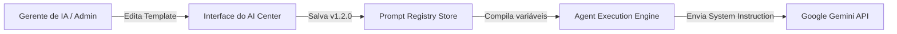
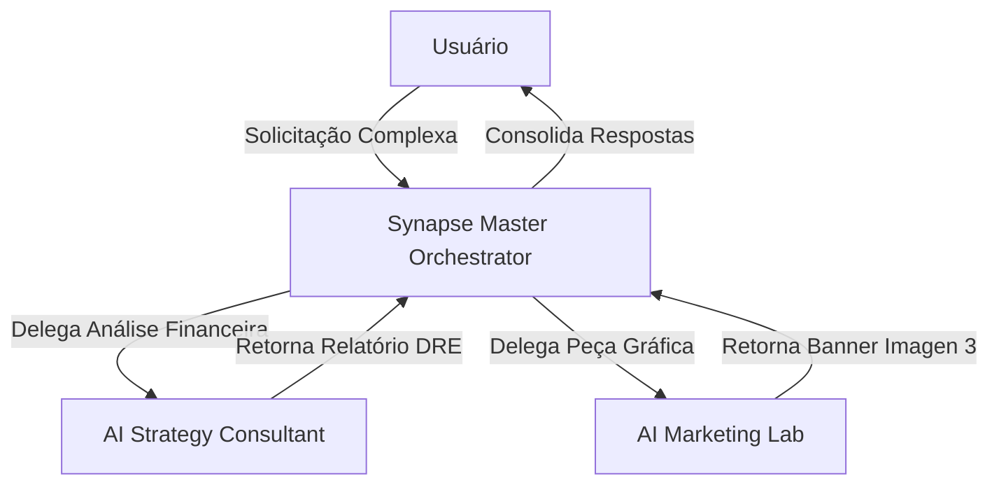
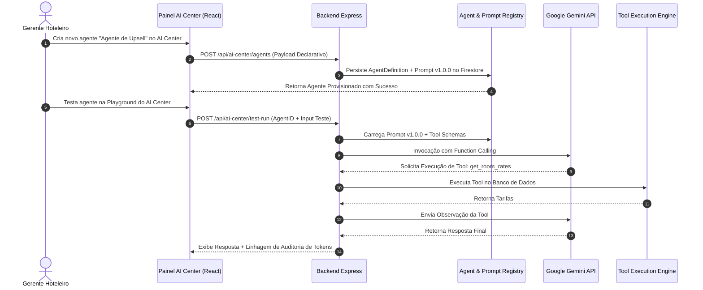

# AI_CENTER_SPECIFICATION.md
**Especificação Técnica Mestra — AI Center & Agent Control Plane**  
**Plataforma:** Synapse Hospitality AHOS (Agentic Hospitality Operating System)  
**Autor:** Principal Software Architect & Head of AI Systems Engineering  
**Data de Emissão:** 03 de Agosto de 2026  
**Status:** Especificação Oficial Aprovada para Implementação V2  

---

## 1. Objetivo do AI Center

O **AI Center** é o núcleo de controle, orquestração, governança e ciclo de vida de Inteligência Artificial da plataforma Synapse. Ele foi projetado para transformar a IA em uma infraestrutura operada de forma declarativa, eliminando prompts espalhados pelo código-fonte, unificando a descoberta de ferramentas (*Function Calling*), garantindo a gestão de memória contextual de curto e longo prazo, e fornecendo um painel administrativo completo para criadores, gestores hoteleiros e engenheiros configurarem, testarem e auditarem a colmeia de agentes autônomos sem necessidade de recompilação do software.

---

## 2. Papel do AI Center dentro da Plataforma

Dentro da arquitetura de microsserviços e contêineres Cloud Run da Synapse, o **AI Center** atua como o **Agent Control Plane (Plano de Controle de Agentes)**:

- **Isolamento Cognitivo:** Separa a lógica de raciocínio da lógica de apresentação (React) e da lógica determinística de negócios (Backend Express).
- **Orquestração Multi-Agente:** Gerencia o ciclo de vida e a distribuição de tarefas entre os agentes autônomos e o orquestrador *Synapse*.
- **Governança & Compliance:** Fornece rastreabilidade total (linhagem de execução, auditoria de ferramentas executadas, controle de custos de tokens e prevenção de alucinações).
- **Habilitação de Agentes Sem Código (No-Code Agent Provisioning):** Permite a criação, parametrização e teste de novos agentes especializados via interface administrativa sem alterar uma linha de código TypeScript.

---

## 3. Arquitetura Geral

```mermaid
graph TD
    subgraph AI Center Control Plane (Server-Side)
        Orchestrator[Synapse Master Orchestrator]
        AgentReg[Agent Registry]
        PromptReg[Prompt Registry]
        ToolReg[Tool Registry & Engine]
        MemEngine[Memory Engine]
        KnowledgeCenter[Knowledge Center & RAG]
        EventEngine[Event Engine & Bus]
    end

    subgraph LLM & External Layer
        Gemini[Google Gemini API Engine - 2.5/3.0]
        Embeddings[Gemini Embedding API]
        FirestoreVec[(Firestore Vector Search)]
        ExternalAPIs[Stripe / Workspace / Aloha / n8n]
    end

    Orchestrator --> AgentReg
    Orchestrator --> PromptReg
    Orchestrator --> ToolReg
    Orchestrator --> MemEngine
    Orchestrator --> KnowledgeCenter
    Orchestrator --> EventEngine

    AgentReg --> Gemini
    ToolReg --> ExternalAPIs
    MemEngine --> FirestoreVec
    KnowledgeCenter --> Embeddings
```

---

## 4. Relação entre os Componentes do AI Center

1. **Synapse Orchestrator ➔ Agent Registry:** O Synapse consulta o catálogo de agentes cadastrados para identificar qual entidade possui as competências necessárias para resolver determinado objetivo.
2. **Agent Registry ➔ Prompt Registry:** Ao instanciar um agente, o registro carrega a versão ativa do seu prompt de sistema e instruções comportamentais.
3. **Agent Registry ➔ Tool Engine:** O agente recebe a lista de esquemas de ferramentas autorizadas que pode invocar durante o seu ciclo ReAct (*Reasoning + Acting*).
4. **Agent Registry ➔ Memory Engine:** Durante o raciocínio, o agente consulta memórias de curto prazo (histórico da sessão) e de longo prazo (preferências históricas e hábitos do hóspede) gerenciadas pelo *Memory Engine*.
5. **Agent Registry ➔ Knowledge Center:** Caso precise responder a dúvidas institucionais ou regulamentos, o agente executa uma busca semântica no *Knowledge Center* via RAG.
6. **Agent Registry ➔ Event Engine:** Agentes escutam eventos do sistema (ex: `booking.created`, `surveillance.motion_detected`) emitidos pelo *Event Engine* e publicam novos eventos com o resultado de suas ações.

---

## 5. O que é um Agente

### Definição Oficial
Um **Agente** no AI Center é uma entidade de software autônoma, declarativa e parametrizada, capaz de processar entradas em linguagem natural ou eventos estruturados, raciocinar sobre o objetivo solicitado, recuperar contexto de memória e conhecimento, invocar ferramentas autorizadas no servidor de forma encadeada, e produzir resultados mensuráveis com estado persistido.

### Ciclo de Vida do Agente
1. **Provisionado (`DRAFT`):** Agente criado no AI Center, em fase de configuração de prompts e ferramentas.
2. **Homologado (`TESTING`):** Agente submetido a baterias de testes em ambiente de staging/sandbox.
3. **Ativo (`ACTIVE`):** Agente publicado e apto a receber requisições de usuários ou eventos em produção.
4. **Pausado (`PAUSED`):** Agente temporariamente desativado pelo administrador para manutenção.
5. **Arquivado (`ARCHIVED`):** Agente descontinuado mantido em histórico imutável.

### Estados de Execução (Runtime States)
- `IDLE`: Aguardando chamada ou evento.
- `REASONING`: Processando o modelo de linguagem (LLM).
- `EXECUTING_TOOL`: Executando uma ação determinística no *Tool Engine*.
- `AWAITING_HUMAN_APPROVAL`: Pausado aguardando validação de operador (*Human-in-the-Loop*).
- `COMPLETED`: Objetivo atingido e resultado entregue.
- `FAILED`: Falha no ciclo ReAct ou exceção de ferramenta tratada.

---

## 6. Estrutura Completa de um Agente

A entidade `AgentDefinition` é armazenada na coleção `/ai_agents` do Firestore com o seguinte esquema formal:

```typescript
export interface AgentDefinition {
  id: string;                         // Identificador único (ex: 'agent_guest_concierge')
  name: string;                       // Nome exibido (ex: 'Concierge Virtual 24/7')
  description: string;                // Descrição semântica para o orquestrador Synapse
  model: string;                      // Modelo Gemini (ex: 'gemini-2.5-flash', 'gemini-3.0-pro')
  promptId: string;                   // ID do prompt vinculado no Prompt Registry
  promptVersion: string;              // Versão do prompt (ex: '1.4.0')
  temperature: number;                // Parâmetro de criatividade (0.0 a 1.0)
  topP: number;                       // Nucleus sampling parameter
  maxOutputTokens: number;            // Limite de tokens de saída
  tools: string[];                    // Array de IDs de ferramentas autorizadas (ex: ['whatsapp_send', 'menu_get'])
  permissions: {
    roles: string[];                  // Roles RBAC necessárias para invocar (ex: ['admin', 'reception'])
    scopes: string[];                 // Escopos de dados acessíveis (ex: ['bookings:read', 'guests:write'])
  };
  knowledge: {
    enabled: boolean;
    collectionIds: string[];          // Bases de conhecimento RAG associadas
  };
  memory: {
    shortTermWindowSize: number;       // Número de mensagens mantidas em memória de trabalho
    longTermRecallEnabled: boolean;   // Se deve buscar vetores no Firestore Vector Search
  };
  events: {
    subscribedEvents: string[];       // Eventos que disparam este agente autonomamente
    emittedEvents: string[];          // Eventos que este agente pode emitir
  };
  humanInTheLoop: {
    requireApproval: boolean;         // Se exige aprovação humana para finalizar ações
    approvalThresholdAmount?: number; // Valor limite financeiro para pedir aprovação
  };
  status: 'DRAFT' | 'TESTING' | 'ACTIVE' | 'PAUSED' | 'ARCHIVED';
  version: string;                    // Versão semântica do agente
  owner: string;                      // Usuário criador/gerente
  createdAt: string;                  // Timestamp ISO
  updatedAt: string;                  // Timestamp ISO
  tenantId: string;                   // ID da empresa/hotel
  propertyId?: string;                // ID da propriedade específica (opcional)
  metadata: Record<string, any>;      // Custom data (ícone, cor do avatar, tags)
}
```

---

## 7. Agent Registry

O **Agent Registry** é o serviço responsável por armazenar, buscar, filtrar e instanciar definições de agentes:

- **Busca Semântica de Competências:** Quando o *Synapse Orchestrator* precisa resolver uma tarefa, ele realiza uma busca no *Agent Registry* combinando a descrição das competências com o contexto do evento.
- **Isolamento Multi-Tenant:** Garante que o locatário A nunca visualize ou execute agentes customizados criados pelo locatário B.
- **Hot Reloading:** Permite atualizar as configurações de um agente em tempo de execução sem reiniciar o servidor backend Express.

---

## 8. Prompt Registry

O **Prompt Registry** centraliza e elimina 100% dos prompts hardcoded no código TypeScript.



### Características do Prompt Registry:
- **Versionamento Estrito (SemVer):** Cada alteração gera uma nova versão (ex: `v1.0.0` -> `v1.1.0`), mantendo histórico completo para auditoria e rollback instantâneo.
- **Template Engine (Handlebars/Mustache):** Suporte a interpolação dinâmica de variáveis contextuais:
  ```
  Você é o concierge do hotel {{hotelName}}.
  O hóspede {{guestName}} está hospedado no quarto {{roomNumber}}.
  Suas preferências registradas são: {{guestPreferences}}.
  ```
- **Ambientes de Sandbox & A/B Testing:** Permite rodar a nova versão de um prompt para 10% do tráfego antes da publicação oficial.

---

## 9. Tool Registry

O **Tool Registry** expõe as capacidades de execução determinística da plataforma para os agentes:

- **Descoberta Dinâmica:** Converte as ferramentas autorizadas do agente em definições oficiais do Gemini SDK (`FunctionDeclaration`).
- **Validação com Esquema Zod:** Garante que os argumentos gerados pelo Gemini sejam rigorosamente validados antes de executar a função TypeScript.
- **Tratamento de Erros & Re-tentativas:** Caso uma API externa falhe (ex: timeout no Stripe), o *Tool Engine* retorna a mensagem de erro formatada para que a IA decida se tenta novamente com outros parâmetros ou informa o usuário.

---

## 10. Memory Engine

```
┌─────────────────────────────────────────────────────────────────────────────┐
│                            MEMORY ENGINE LAYER                              │
├──────────────────────────────────┬──────────────────────────────────────────┤
│ 1. MEMÓRIA DE CURTO PRAZO        │ Sliding Window de Tokens da Sessão       │
│ 2. MEMÓRIA OPERACIONAL           │ Estado do Grafo ReAct Atual              │
│ 3. MEMÓRIA EPISÓDICA             │ Histórico Cronológico de Estadias        │
│ 4. MEMÓRIA SEMÂNTICA             │ Firestore Vector Search (Embeddings)     │
│ 5. MEMÓRIA DOCUMENTAL            │ Text Chunks RAG do Knowledge Center      │
└──────────────────────────────────┴──────────────────────────────────────────┘
```

---

## 11. Knowledge Center

O **Knowledge Center** conecta fontes de conhecimento não-estruturadas aos agentes:

1. **Pipeline de Ingestão:** Faz o upload de PDFs, manuais e guias, realizando divisão em blocos (*chunking* de 500 tokens) e gerando vetores via `text-embedding-004`.
2. **Integração com Google Drive:** Lê documentos diretamente do Google Drive do hotel via OAuth 2.0.
3. **Preparação para NotebookLM & Gemini Grounding:** Estrutura a base de dados para integrar diretamente com a API do Google NotebookLM e fontes de busca em tempo real do Google Search.

---

## 12. Comunicação entre Agentes



- **Prevenção de Loops:** Cada mensagem carrega um `maxHopCount` (máximo de 5 saltos). Se atingido, a execução é interrompida e enviada para revisão do operador.
- **Barramento de Mensagens Tipadas:** Comunicação via payloads JSON estritos sem ambiguidades.

---

## 13. Segurança & Governança (RBAC & Tenant Isolation)

1. **Isolamento de Locatário (Tenant Boundary):** O `tenantId` é injetado pelo backend em todas as ferramentas, impedindo vazamentos de dados entre hotéis.
2. **RBAC de Ferramentas:** Ferramentas sensíveis (ex: `refund_payment`, `cancel_booking`) só podem ser invocadas se o usuário que iniciou a sessão possuir a role correspondente.
3. **Escopos de Execução:** Impedimento de *Prompt Injection* garantido pelo encapsulamento das chamadas de ferramentas no servidor.

---

## 14. Configuração Declarativa do AI Center

Com o AI Center, a inclusão de um novo agente ou a alteração de um comportamento passa a ser um processo 100% declarativo:

```
Acessar Painel ➔ Selecionar 'Criar Agente' ➔ Definir Nome e Modelo ➔ Escrever Prompt ➔ Selecionar Ferramentas ➔ Testar na Playground ➔ Publicar
```

Nenhuma linha de código precisa ser editada, compilada ou implantada via CI/CD.

---

## 15. Painel Administrativo do AI Center

A interface do **AI Center** no Painel Administrativo incluirá os seguintes módulos:

1. **Agentes Hub (`/admin/ai-center/agents`):** Lista, criação, edição e monitoramento do status de todos os agentes.
2. **Prompt Studio (`/admin/ai-center/prompts`):** Editor visual de prompts com controle de versão, diff de alterações e testes sandbox.
3. **Tool Catalog (`/admin/ai-center/tools`):** Catálogo de ferramentas disponíveis com relatórios de uso e taxa de erro.
4. **Knowledge Base Manager (`/admin/ai-center/knowledge`):** Upload e gerenciamento de arquivos RAG e integração com Google Drive.
5. **AI Telemetry & Financial Audit (`/admin/ai-center/telemetry`):** Dashboards de uso de tokens, custos acumulados da API Gemini e tempo de resposta por agente.

---

## 16. Roadmap do AI Center (2026–2031)

- **2026:** Implementação do AI Center V2, Prompt Registry e Tool Engine server-side.
- **2027:** Ativação do Firestore Vector Search para Memória Semântica e RAG.
- **2028:** Suporte a orquestração em colmeia (*Swarm*) de múltiplos agentes.
- **2029:** Integração com Gemini Live API para atendimento por áudio/vídeo multimodal em tempo real.
- **2030–2031:** Lançamento da loja de agentes (*Synapse Agent Marketplace*) para desenvolvedores terceiros.

---

## 17. Diagrama de Sequência Completo do AI Center



---

## 18. ADRs (Architecture Decision Records)

### ADR 001: Adocão do Google Gemini SDK (`@google/genai`) com Proxy Server-Side
- **Decisão:** Realizar todas as chamadas de IA exclusivamente no servidor Express (`server.ts`) utilizando a nova biblioteca oficial do Google Gemini.
- **Alternativas Descartadas:** Chamadas diretas do frontend React; SDKs legados `@google/generative-ai`.
- **Benefícios:** Segurança total das chaves `GEMINI_API_KEY`, prevenção de vazamentos e suporte nativo a Function Calling tipado.

### ADR 002: Eliminação de Prompts Hardcoded e Criação do Prompt Registry
- **Decisão:** Armazenar todos os prompts no Firestore com controle de versão SemVer e interpolação de variáveis.
- **Alternativas Descartadas:** Strings literais dentro dos componentes React ou arquivos de serviço.
- **Benefícios:** Edição em tempo de execução sem recompilação, testes A/B e facilidade de manutenção.

### ADR 003: Validação Estrita de Ferramentas via Esquemas Zod
- **Decisão:** Toda ferramenta executável pela IA deve ter seus parâmetros validados por um esquema Zod antes de atingir o banco de dados.
- **Alternativas Descartadas:** Avaliação e execução cega de objetos JSON retornados pela IA.
- **Benefícios:** Prevenção total de injeções Maliciosas, falhas de tipo e comportamentos imprevisíveis.

---
*Especificação Oficial do AI Center gerada em 03 de Agosto de 2026.*
