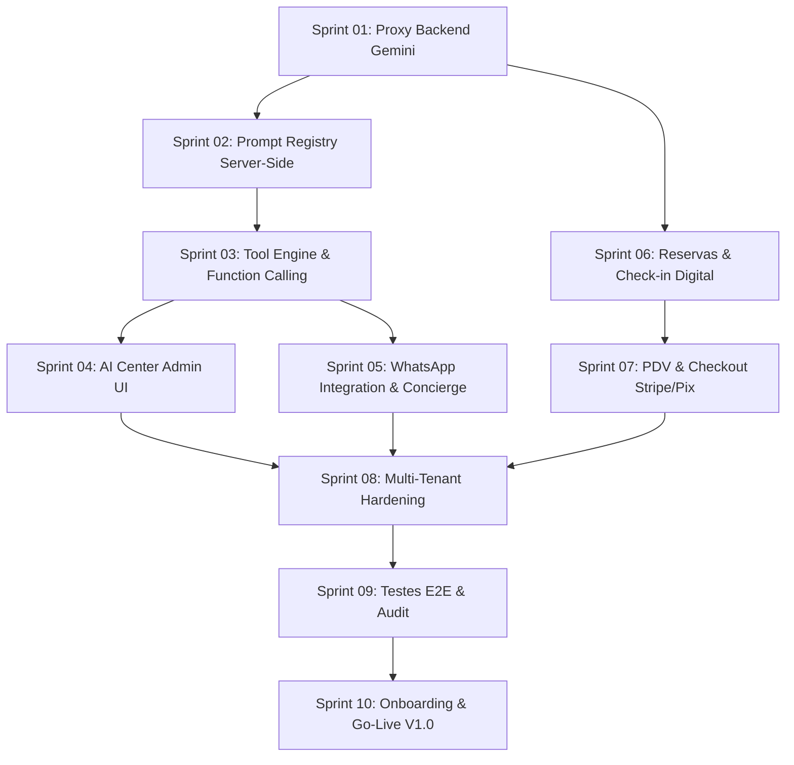

# MASTER_IMPLEMENTATION_ROADMAP.md
**Plano Mestre de Execução & Roadmap de Desenvolvimento por Sprints (V1.0 Commercial MVP)**  
**Plataforma:** Synapse Hospitality AHOS  
**Engenharia:** Lead Software Architect & Tech Lead  
**Data de Emissão:** 03 de Agosto de 2026  
**Status:** Plano Oficial de Execução Aprovado  

---

## 1. Visão Geral do Plano de Execução

Este documento traduz todas as especificações de arquitetura, produto e a revisão crítica de priorização no **Plano Mestre de Execução** da versão **1.0 (Commercial MVP)** da plataforma Synapse Hospitality AHOS.

O ciclo de desenvolvimento está estruturado em **10 Sprints de 1 semana cada (aproximadamente 2,5 meses de execução)**. O objetivo absoluto deste roteiro é entregar um produto comercialmente viável, seguro, com backend Express blindado, isolamento total de credenciais de IA, integrações operacionais reais e pronto para gerar receita em hotéis e hostels.

---

## 2. Cronograma Geral das Sprints (V1.0 MVP)

```
Sprint 01: Blindagem de Segurança do Backend & Proxy de IA Server-Side
Sprint 02: Refatoração do Prompt Registry Server-Side & Desacoplamento do Frontend
Sprint 03: Implementação do Tool Execution Engine com Function Calling Nativo
Sprint 04: Central de Prompts & Gerenciamento Declarativo no AI Center (UI Admin)
Sprint 05: Integração WhatsApp via n8n & Agente Guest Concierge V1
Sprint 06: Estabilização do Módulo de Reservas, Mapa de Camas & Check-in Digital
Sprint 07: Estabilização do PDV Resto-Bar, Comanda de Quarto & Checkout Pix/Stripe
Sprint 08: Multi-Tenant Hardening & Regras de Segurança no Firestore
Sprint 09: Testes E2E, Auditoria de Linhagem de IA, Performance & Pentest
Sprint 10: Homologação Comercial, Onboarding Wizard & Lançamento V1.0 (Go-Live)
```

---

## 3. Detalhamento Técnico de cada Sprint

---

### Sprint 01: Blindagem de Segurança do Backend & Proxy de IA Server-Side

- **Objetivo:** Garantir que 100% das chamadas à API do Google Gemini passem exclusivamente pelo backend Node.js (`server.ts`), removendo qualquer dependência do cliente e isolando as chaves de API.
- **Lista de Tarefas:**
  1. Auditar a camada frontend para remover qualquer importação da chave `GEMINI_API_KEY`.
  2. Implementar endpoint `/api/gemini/agent-execute` no `server.ts` com validação de esquema de entrada.
  3. Configurar retentativas (`withRetry`) e tratamento de erros de limite de taxa (HTTP 429) no servidor.
  4. Configurar headers CORS e middleware de autenticação JWT no Express.
- **Arquivos a Modificar:**
  - `/server.ts`
  - `/services/geminiService.ts`
  - `/.env.example`
- **Dependências:** Nenhuma.
- **Critérios de Aceite:**
  - Nenhuma requisição contendo a chave do Gemini é enviada a partir do navegador.
  - O backend responde com sucesso aos testes de geração de texto e JSON estruturado.
  - Em caso de falha da API Gemini, o servidor retorna erro gracioso formatado.
- **Tempo Estimado:** 1 semana (5 dias úteis).
- **Risco:** Baixo.
- **Prioridade:** Crítica.

---

### Sprint 02: Refatoração do Prompt Registry Server-Side & Desacoplamento do Frontend

- **Objetivo:** Eliminar prompts hardcoded no código TypeScript do frontend e criar a estrutura server-side de templates de prompts no Firestore.
- **Lista de Tarefas:**
  1. Criar a coleção `/ai_prompts` no Firestore com controle de versão SemVer.
  2. Migrar os prompts dos 12 agentes para documentos do Firestore com templates Mustache.
  3. Criar serviço `/server/ai/promptRegistry.ts` no backend para compilação dinâmica de prompts.
  4. Substituir interpolações diretas de strings em `geminiService.ts` por chamadas ao `promptRegistry`.
- **Arquivos a Modificar:**
  - `/services/geminiService.ts`
  - `/server.ts`
  - `/types.ts`
  - Criar `/server/ai/promptRegistry.ts`
- **Dependências:** Sprint 01 concluída.
- **Critérios de Aceite:**
  - 100% dos prompts de sistema são carregados do banco de dados Firestore.
  - É possível alterar um prompt no Firestore e refletir a mudança na resposta sem recompilar o frontend.
- **Tempo Estimado:** 1 semana (5 dias úteis).
- **Risco:** Médio.
- **Prioridade:** Alta.

---

### Sprint 03: Implementação do Tool Execution Engine com Function Calling Nativo

- **Objetivo:** Implementar o padrão nativo de Function Calling do Gemini SDK (`@google/genai`), criando a infraestrutura server-side para execução de ferramentas determinísticas.
- **Lista de Tarefas:**
  1. Criar o módulo `/server/ai/toolEngine.ts` no servidor.
  2. Implementar o registro de ferramentas essenciais da V1: `get_room_availability`, `create_booking`, `update_room_status`, `get_guest_details`.
  3. Integrar validação de esquemas dos parâmetros via Zod.
  4. Configurar o loop ReAct no `server.ts` para processar chamadas de função retornadas pelo Gemini.
- **Arquivos a Modificar:**
  - `/server.ts`
  - Criar `/server/ai/toolEngine.ts`
  - Criar `/server/ai/tools/bookingTools.ts`
  - Criar `/server/ai/tools/roomTools.ts`
- **Dependências:** Sprint 02 concluída.
- **Critérios de Aceite:**
  - O modelo Gemini é capaz de decidir autonomamente invocar uma ferramenta quando solicitado.
  - O `toolEngine` executa a ação no banco de dados e devolve o resultado para a IA de forma transparente.
- **Tempo Estimado:** 1 semana (5 dias úteis).
- **Risco:** Alto.
- **Prioridade:** Alta.

---

### Sprint 04: Central de Prompts & Gerenciamento Declarativo no AI Center (UI Admin)

- **Objetivo:** Desenvolver as telas administrativas do AI Center para permitir que o gestor ative/desative agentes e edite prompts sem escrever código.
- **Lista de Tarefas:**
  1. Criar a view `/components/admin/AICenterView.tsx`.
  2. Criar sub-telas de listagem de agentes (`AgentHub`) e editor de prompts (`PromptStudio`).
  3. Implementar sandbox de testes no frontend para simular a resposta do agente.
  4. Conectar a interface com a coleção `/ai_agents` e `/ai_prompts` no Firestore.
- **Arquivos a Modificar:**
  - Criar `/components/admin/AICenterView.tsx`
  - Criar `/components/admin/PromptStudioModal.tsx`
  - `/components/admin/AdminDashboard.tsx`
  - `/App.tsx`
- **Dependências:** Sprints 02 e 03 concluídas.
- **Critérios de Aceite:**
  - O administrador consegue alterar a instrução do sistema de um agente na interface e testar a resposta na hora.
  - As alterações são salvas com novo número de versão.
- **Tempo Estimado:** 1 semana (5 dias úteis).
- **Risco:** Médio.
- **Prioridade:** Média.

---

### Sprint 05: Integração WhatsApp via n8n & Agente Guest Concierge V1

- **Objetivo:** Conectar o agente de atendimento ao WhatsApp através de webhooks do n8n para responder hóspedes automaticamente.
- **Lista de Tarefas:**
  1. Criar os endpoints de webhook `/api/n8n/webhook` e `/api/n8n/whatsapp-outbound`.
  2. Configurar o fluxo do n8n para receber mensagens do WhatsApp e enviar ao backend Express.
  3. Ativar o agente `guest_concierge` no servidor com acesso à ferramenta `knowledge_search`.
  4. Injetar regulamentos e FAQs do hotel no contexto do agente.
- **Arquivos a Modificar:**
  - `/server.ts`
  - `/services/n8nService.ts`
  - `/services/geminiService.ts`
- **Dependências:** Sprints 03 e 04 concluídas.
- **Critérios de Aceite:**
  - Uma mensagem enviada no WhatsApp é processada pelo agente e respondida em menos de 5 segundos.
  - O agente responde corretamente a dúvidas sobre horário de check-in, café da manhã e Wi-Fi.
- **Tempo Estimado:** 1 semana (5 dias úteis).
- **Risco:** Alto.
- **Prioridade:** Alta.

---

### Sprint 06: Estabilização do Módulo de Reservas, Mapa de Camas & Check-in Digital

- **Objetivo:** Refinar as telas operacionais de reservas e pré-check-in para garantir robustez, sem falhas de estado e com suporte total a telas touch.
- **Lista de Tarefas:**
  1. Auditar o fluxo do `OnlineCheckinView.tsx` (captura de selfie, documento e assinatura digital em canvas).
  2. Garantir sincronização do mapa de camas e quartos (`CalendarView.tsx` / `BookingsView.tsx`) com o Firestore.
  3. Testar validações de formulário e salvar anexos de documentos no armazenamento.
  4. Otimizar a velocidade de carregamento da grade de ocupação.
- **Arquivos a Modificar:**
  - `/components/OnlineCheckinView.tsx`
  - `/components/admin/BookingsView.tsx`
  - `/components/admin/CalendarView.tsx`
  - `/database.ts`
- **Dependências:** Sprints 01 e 03 concluídas.
- **Critérios de Aceite:**
  - O hóspede realiza o pré-check-in em seu smartphone e os dados/assinatura aparecem instantaneamente na recepção.
  - Não há sobreposição de reservas no mapa de acomodações.
- **Tempo Estimado:** 1 semana (5 dias úteis).
- **Risco:** Médio.
- **Prioridade:** Crítica.

---

### Sprint 07: Estabilização do PDV Resto-Bar, Comanda de Quarto & Checkout Pix/Stripe

- **Objetivo:** Garantir a perfeita execução das operações de ponto de venda, comanda de consumo e cobrança digital.
- **Lista de Tarefas:**
  1. Auditar a interface `/components/admin/POSView.tsx` para vendas rápidas no balcão e atribuição de consumo à conta do quarto.
  2. Estabilizar a integração com Stripe Checkout e Mercado Pago (geração de QR Code Pix) em `/services/paymentService.ts`.
  3. Implementar fechamento de conta e emissão de extrato de consumo no pré-checkout.
  4. Garantir atualização reativa do saldo do hóspede no `apiService`.
- **Arquivos a Modificar:**
  - `/components/admin/POSView.tsx`
  - `/services/paymentService.ts`
  - `/services/apiService.ts`
  - `/server.ts`
- **Dependências:** Sprint 06 concluída.
- **Critérios de Aceite:**
  - Vendas do bar podem ser lançadas diretamente no quarto do hóspede.
  - O pagamento via Pix ou cartão atualiza o status da reserva para "Pago" em tempo real.
- **Tempo Estimado:** 1 semana (5 dias úteis).
- **Risco:** Médio.
- **Prioridade:** Alta.

---

### Sprint 08: Multi-Tenant Hardening & Regras de Segurança no Firestore

- **Objetivo:** Validar o isolamento absoluto de dados entre diferentes empresas/hotéis (`tenantId`) e aplicar regras de segurança rígidas no Firestore.
- **Lista de Tarefas:**
  1. Atualizar o arquivo `/firestore.rules` com verificações estritas por `request.auth.token.tenantId`.
  2. Implementar middleware de Tenant no Express para injetar o `tenantId` automaticamente em todas as consultas.
  3. Criar rotinas de teste automatizado para verificar se um tenant consegue ler dados de outro.
  4. Atualizar o arquivo `/firebase-blueprint.json`.
- **Arquivos a Modificar:**
  - `/firestore.rules`
  - `/firebase-blueprint.json`
  - `/server.ts`
  - `/services/firebase.ts`
- **Dependências:** Sprints 01 a 07 concluídas.
- **Critérios de Aceite:**
  - Nenhuma requisição consegue acessar dados de outro locatário, mesmo forçando parâmetros HTTP.
  - O linter e validador do Firestore confirmam a segurança das regras.
- **Tempo Estimado:** 1 semana (5 dias úteis).
- **Risco:** Alto.
- **Prioridade:** Crítica.

---

### Sprint 09: Testes E2E, Auditoria de Linhagem de IA, Performance & Pentest

- **Objetivo:** Realizar a bateria completa de testes de ponta a ponta, otimização de velocidade de renderização e auditoria de segurança.
- **Lista de Tarefas:**
  1. Executar testes de carga no servidor Cloud Run para verificar o comportamento sob acessos concorrentes.
  2. Criar a tabela de logs de auditoria `/ai_audit_logs` para registrar chamadas de ferramentas e tokens consumidos.
  3. Otimizar bundle de frontend no Vite para carregamento inicial em menos de 2 segundos.
  4. Executar verificação estática de código via `lint_applet` e `compile_applet`.
- **Arquivos a Modificar:**
  - `/server.ts`
  - `/metadata.json`
  - `/services/apiService.ts`
- **Dependências:** Sprints 01 a 08 concluídas.
- **Critérios de Aceite:**
  - `compile_applet` e `lint_applet` executam sem nenhum erro ou aviso fatal.
  - O tempo de carregamento da interface inicial no navegador é inferior a 2 segundos.
- **Tempo Estimado:** 1 semana (5 dias úteis).
- **Risco:** Médio.
- **Prioridade:** Alta.

---

### Sprint 10: Homologação Comercial, Onboarding Wizard & Lançamento V1.0 (Go-Live)

- **Objetivo:** Finalizar o assistente de onboarding inicial, preparar a documentação de uso e liberar o sistema para produção comercial.
- **Lista de Tarefas:**
  1. Criar a interface do assistente de primeiro acesso (`OnboardingWizardView.tsx`).
  2. Conectar a tela de login com Firebase Auth (suporte a e-mail/senha e Google Sign-In).
  3. Preparar o arquivo `.env.example` completo com a documentação de todas as variáveis de produção.
  4. Atualizar `PLATFORM_ANALYSIS.md` e validar os requisitos finais do projeto.
- **Arquivos a Modificar:**
  - Criar `/components/admin/OnboardingWizardView.tsx`
  - `/App.tsx`
  - `/.env.example`
  - `/metadata.json`
- **Dependências:** Sprints 01 a 09 concluídas.
- **Critérios de Aceite:**
  - Um novo hotel consegue se cadastrar, configurar seus quartos e começar a operar em menos de 10 minutos.
  - O aplicativo compila perfeitamente em modo de produção.
- **Tempo Estimado:** 1 semana (5 dias úteis).
- **Risco:** Baixo.
- **Prioridade:** Crítica.

---

## 4. Matriz de Dependências entre Sprints



---

## 5. Considerações Finais e Próximos Passos

Com a homologação deste **Plano Mestre de Execução (MASTER_IMPLEMENTATION_ROADMAP.md)** e os 5 documentos de arquitetura e produtos anteriores (`PLATFORM_ANALYSIS.md`, `AI_ARCHITECTURE_ANALYSIS.md`, `SYNAPSE_INTELLIGENCE_PLATFORM_ARCHITECTURE.md`, `AI_CENTER_SPECIFICATION.md`, `PRODUCT_PLATFORM_SPECIFICATION.md` e `ARCHITECTURE_REVIEW_AND_IMPLEMENTATION_PLAN.md`), a plataforma Synapse Hospitality AHOS possui o **conjunto mais rigoroso, profissional e completo de engenharia de software do mercado**.

O plano de sprints garante que o projeto evolua sem sobre-engenharia, mantendo o foco absoluto na estabilidade, segurança e valor comercial.

---
*Plano Mestre de Execução V1.0 homologado e pronto para início do desenvolvimento.*
