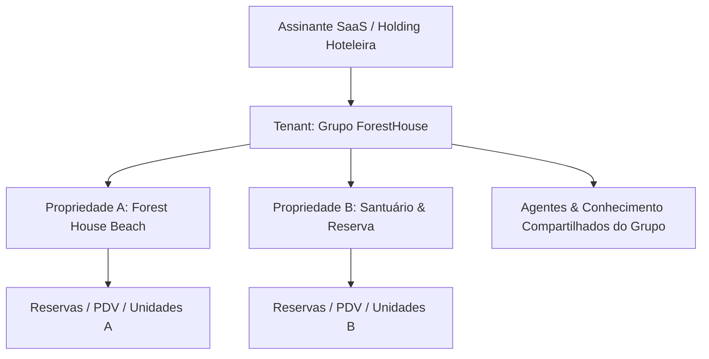
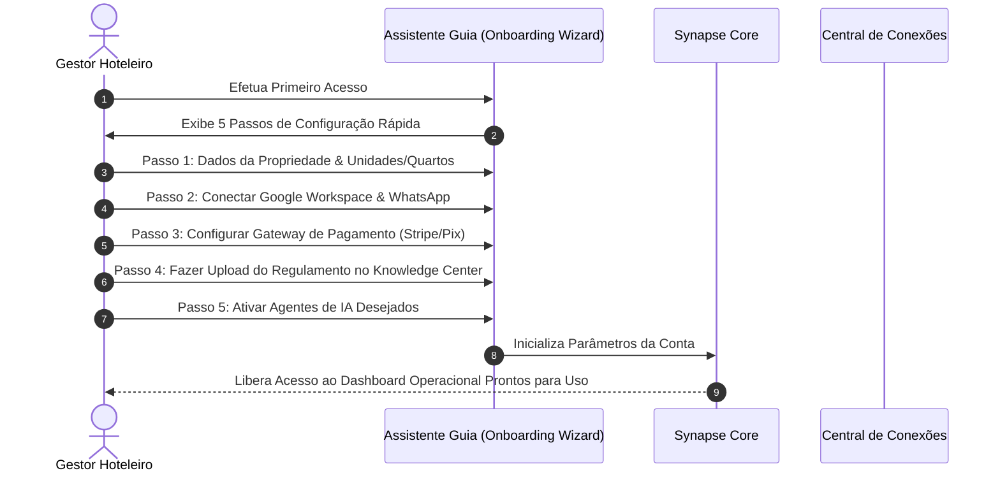
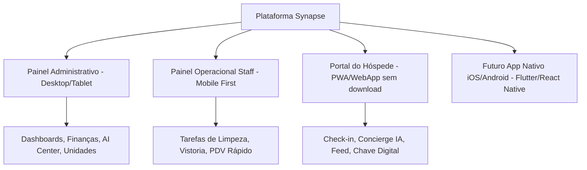

# PRODUCT_PLATFORM_SPECIFICATION.md
**Especificação Oficial de Produto SaaS — Plataforma Synapse AHOS**  
**Produto:** Synapse Hospitality Agentic Operating System (SaaS Multi-Tenant)  
**Autor:** Head of Product & Principal SaaS Architect  
**Data de Emissão:** 03 de Agosto de 2026  
**Status:** Especificação Oficial Aprovada de Produto e Experiência do Cliente  

---

## 1. Visão do Produto

O **Synapse Hospitality AHOS** é a primeira plataforma SaaS de gestão operacional hoteleira, gastronômica e de entretenimento verdadeiramente **orientada a Agentes Autônomos de Inteligência Artificial**. 

O produto foi desenhado para eliminar a fragmentação de softwares em hotéis, hostels, pousadas e resorts, substituindo sistemas legados, planilhas e atendimentos manuais por uma **plataforma integrada de alta eficiência**, onde humanos e agentes de IA colaboram em tempo real. O resultado é a redução de até 80% nos custos operacionais repetitivos, aumento substancial da taxa de ocupação via precificação dinâmica e uma experiência memorável para o hóspede antes, durante e após a estadia.

---

## 2. Posicionamento de Mercado

O Synapse posiciona-se no mercado global de **Hospitality Tech** como a categoria inovadora de **AHOS (Agentic Hospitality Operating System)**:

```
┌─────────────────────────────────────────────────────────────────────────────┐
│                       MATRIZ DE POSICIONAMENTO SaaS                         │
├──────────────────────────────┬──────────────────────────────────────────────┤
│ PMSs Tradicionais            │ Sistemas engessados, puramente passivos e    │
│ (Cloudbeds, Totvs, Opera)    │ focados em registro de formulários.          │
├──────────────────────────────┼──────────────────────────────────────────────┤
│ Channel Managers Isolados    │ Apenas distribuem tarifas sem inteligência   │
│ (Beds24, StaaAh)             │ contextual de precificação.                  │
├──────────────────────────────┼──────────────────────────────────────────────┤
│ SYNAPSE AHOS                 │ Plataforma All-in-One ativamente autônoma.   │
│ (Next-Gen Hospitality SaaS)  │ Agentes de IA tomam decisões, operam vendas  │
│                              │ e coordenam a operação 24/7.                 │
└──────────────────────────────┴──────────────────────────────────────────────┘
```

---

## 3. Público-Alvo

1. **Gestores e Proprietários de Hotéis/Hostels:** Buscam redução de custos com pessoal, centralização de dados e aumento da margem de lucro por quarto (RevPAR).
2. **Equipes de Recepção e Operação:** Necessitam de interfaces intuitivas, rápidas e sem atrito para gerenciar check-ins, comanda de bar, consumo e limpeza.
3. **Equipes de Marketing e Vendas:** Exigem automação de campanhas, CRM ativo e nutrição automática de leads via WhatsApp e e-mail.
4. **Hóspedes Contemporâneos & Nômades Digitais:** Desejam autonomia, check-in 100% digital via smartphone, concierge instantâneo por IA e interação com a comunidade do hotel.

---

## 4. Tipos de Clientes (Customer Personas)

- **Persona A — Boutique Hotels & Pousadas de Charme:** Foco em atendimento hiper-personalizado e automação do pré-arrival.
- **Persona B — Hostels & Co-Living Spaces:** Foco na gestão de dormitórios/camas, atividades em grupo, feed comunitário e coworking.
- **Persona C — Redes Hoteleiras Multipropriedade:** Foco em gestão centralizada multi-tenant, relatórios consolidados e controle rígido de acessos.
- **Persona D — Complexos de Eco-Resort & Eventos:** Foco em pacotes de experiências, restaurantes integrados, delivery interno e segurança por visão computacional.

---

## 5. Multiempresa (Multi-Tenant Architecture)

A plataforma opera em modelo **Multi-Tenant Nativo**:



- **Isolamento de Dados:** Cada empresa possui seu contêiner lógico de dados, hóspedes, finanças e registros de IA totalmente isolado.
- **Visão Consolidada:** Donos de redes podem alternar entre unidades com um clique ou visualizar dashboards financeiros unificados.

---

## 6. Como uma Empresa é Criada (Tenant Provisioning)

1. **Adesão Comercial:** O cliente escolhe um plano no site público e realiza o checkout online (via Stripe/Mercado Pago).
2. **Criação Automática da Organização:** A plataforma provisiona o `tenantId`, gera a conta de administrador primário e cria a propriedade padrão no Firestore em menos de 3 segundos.
3. **Emissão das Credenciais:** Envio do link de acesso exclusivo (`https://app.synapsehospitality.com/login`) com token de primeiro acesso para o e-mail do gestor.

---

## 7. Processo Completo de Onboarding



---

## 8. Primeiro Acesso

No primeiro acesso, o usuário é recepcionado pela tela de **Boas-Vindas Reativa**:
- Apresentação de um vídeo explicativo de 60 segundos.
- Ativação do assistente de onboarding inteligente que guia o preenchimento dos dados essenciais.
- Configuração simplificada da senha definitiva e autenticação em dois fatores (2FA).

---

## 9. Assistente de Configuração Inicial (Onboarding Wizard)

O **Onboarding Wizard** é estruturado em etapas modulares com barra de progresso em tempo real:
1. **Perfil do Hotel:** Nome, logotipo, endereço, moeda nativa, fuso horário e políticas de check-in/out.
2. **Mapa de Acomodações:** Cadastro de quartos privativos e camas de dormitório compartilhado com fotos e facilidades.
3. **Regras Tarifárias:** Inserção da tarifa base diária e restrições de estadia mínima.
4. **Ativação da Equipe:** Convite por e-mail para recepcionistas, gerentes e camareiras com perfil de acesso pré-definido.

---

## 10 a 19. Guias de Conexão de Integrações

A central de integrações (`/admin/integrations`) oferece uma experiência **One-Click Integration** para os principais serviços do mercado:

### 10. Conectar Google Workspace (Central)
- Clique no botão "Conectar Google Workspace" para autenticação OAuth 2.0 unificada.
- Autorização dos escopos necessários para permitir que os agentes leiam e escrevam nos serviços Google.

### 11. Conectar Gmail
- Habilita o envio automático de confirmações de reserva, vouchers e e-mails de avaliação com a conta oficial `@hotel.com`.

### 12. Conectar Google Drive
- Permite que o *Knowledge Center* sincronize arquivos PDF, manuais e cardápios diretamente de uma pasta do Google Drive.

### 13. Conectar Google Calendar
- Sincroniza tarefas do staff, manutenções programadas e eventos de entretenimento diretamente na agenda da equipe.

### 14. Conectar Google Sheets
- Permite exportação automática de relatórios diários de fechamento de caixa e DRE em planilhas compartilhadas.

### 15. Conectar Google Docs
- Utilizado pelos agentes de marketing para gerar relatórios formais e minutas de contratos.

### 16. Conectar WhatsApp (Official / n8n API)
- Leitura do QR Code oficial para conectar o número do hotel, permitindo que o agente *Guest Journey* envie pré-check-ins e tire dúvidas de hóspedes 24/7.

### 17. Conectar Stripe & Mercado Pago
- Conexão segura via OAuth Connect/API Key para processar pagamentos de reservas online, cobranças por Link e PIX instantâneo no PDV.

### 18. Conectar Aloha Pro & Beds24
- Inserção da API Key e ID da Propriedade para sincronização automática de inventário de quartos e espelho de faturas com OTAs (Booking.com, Airbnb, Expedia).

### 19. Conectar n8n Automation Engine
- Inserção da URL do servidor n8n do hotel para disparo de fluxos avançados de automação externa.

---

## 20. Configuração Inicial dos Agentes

Na tela do **AI Center**, o administrador pode:
- Ativar ou desativar cada um dos 12 agentes com um toggle visual.
- Definir o tom de voz do atendimento (Ex: *Formal e Elegante*, *Descontraído e Jovem*, *Direto e Objetivo*).
- Definir limites de autonomia (Ex: *"Permitir que a IA conceda até 10% de desconto sem pedir aprovação"*).

---

## 21. Configuração Inicial do Knowledge Center

O gestor arrasta e solta arquivos (PDF, DOCX, TXT) com as políticas do hotel. O sistema processa os documentos automaticamente e exibe o status de indexação:

```
[Upload de Regulamento.pdf] ➔ Status: Processando (Vectorizing...) ➔ Status: Prontos para Uso pelos Agentes (100%)
```

---

## 22. Configuração Inicial das Ferramentas (Tool Enablement)

Matriz visual onde o gestor define quais ferramentas cada agente pode utilizar:

| Agente | Enviar WhatsApp | Alterar Tarifas | Criar Despesas | Cobrar Cartão |
|---|:---:|:---:|:---:|:---:|
| **Guest Journey AI** | ✅ Sim | ❌ Não | ❌ Não | ✅ Sim |
| **Dynamic Pricing AI** | ❌ Não | ✅ Sim | ❌ Não | ❌ Não |
| **Financial AI** | ❌ Não | ❌ Não | ✅ Sim | ❌ Não |

---

## 23. Estrutura de Módulos Operacionais

A plataforma é dividida em 8 módulos funcionais:
1. **PMS & Reservas:** Tabela de reservas, mapa de disponibilidade e check-in/out.
2. **PDV Resto-Bar & Delivery:** Atendimento de mesas, comanda de quarto e pedidos externos.
3. **Gestão de Coworking:** Reserva de estações de trabalho e planos por hora/dia.
4. **CRM & Portal do Hóspede:** Social feed, concierge, mídias e gamificação.
5. **Governança & Manutenção:** Quadro Kanban de tarefas da equipe e vistoria de quartos.
6. **Marketing & Growth AI:** Gerador de campanhas, copys e postagens sociais.
7. **Financeiro & DRE:** Controle de entradas, saídas, fluxo de caixa e relatórios.
8. **AI Center & Vigilância:** Painel de controle de agentes, prompts e monitoramento por vídeo.

---

## 24. Marketplace de Módulos (App Store)

Espaço onde os clientes podem ativar módulos adicionais sob demanda:
- Módulo de Conexão com Motores de Reserva Direta.
- Módulo de Inteligência de Câmeras IP (Visão Computacional).
- Módulo de Gestão de Eventos e Locação de Espaços.

---

## 25. Marketplace de Agentes (Agent Store)

Área onde proprietários podem contratar ou baixar agentes especializados criados pela comunidade ou pela equipe Synapse:
- *Agente Especialista em Sommelier & Harmonização de Vinhos*.
- *Agente de Resolução de Reclamações e Gestão de Crise no Tripadvisor*.
- *Agente de Gestão de Sustentabilidade e Consumo de Energia*.

---

## 26. Planos Starter, Pro e Enterprise

```
┌─────────────────────────────────────────────────────────────────────────────┐
│                       MATRIZ DE PLANOS E RECURSOS                           │
├───────────────────┬─────────────────────┬───────────────────────────────────┤
│ PLANO             │ RECURSOS INCLUSOS   │ LIMITE DE IA                      │
├───────────────────┼─────────────────────┼───────────────────────────────────┤
│ STARTER           │ Até 15 Unidades,    │ 100.000 Tokens de IA / mês        │
│ (Pequenas Pousadas│ PMS Básica, PDV,    │ 3 Agentes Ativos                  │
│  e Hostels)       │ Check-in Digital    │                                   │
├───────────────────┼─────────────────────┼───────────────────────────────────┤
│ PRO               │ Até 50 Unidades,    │ 1.000.000 Tokens de IA / mês      │
│ (Hotels Médios e  │ PMS Completo, PDV,  │ Todos os 12 Agentes Ativos        │
│  Co-Livings)      │ CRM, Integrações    │ Integração WhatsApp & Workspace   │
├───────────────────┼─────────────────────┼───────────────────────────────────┤
│ ENTERPRISE        │ Unidades Ilimitadas,│ Tokens Ilimitados (Fair Use)      │
│ (Redes Hoteleiras │ Multi-Tenant,       │ Agentes Customizados No-Code      │
│  e Resorts)       │ Suporte Dedicado 24/7│ SLA de Atendimento de 99.9%       │
└───────────────────┴─────────────────────┴───────────────────────────────────┘
```

---

## 27. Licenciamento

Licenciamento baseado em subscrição mensal/anual por propriedade com cobrança recorrente via Stripe. O não pagamento gera suspensão graciosa após 7 dias de aviso prévio.

---

## 28 e 29. Controle de Uso de IA e Consumo de Tokens

O painel de telemetria de IA exibe:
- Barra visual do consumo de tokens do mês atual (`750.000 / 1.000.000 Tokens`).
- Gráfico de pizza mostrando qual agente consome mais tokens.
- Opção de recarga rápida de pacotes adicionais de tokens (*Top-up Token Bundles*).

---

## 30 a 34. Gestão de Usuários, Perfis, RBAC e Auditoria

### Perfis de Acesso Pré-Definidos (RBAC):
1. **Super Admin:** Acesso total a configurações, finanças e AI Center.
2. **Gerente Operacional:** Acesso a reservas, PDV, governança e relatórios.
3. **Recepcionista:** Acesso a check-ins, comanda de quarto e mensagens de hóspedes.
4. **Camareira / Limpeza:** Acesso exclusivo à lista de tarefas de governança no smartphone.
5. **Atendente de Bar / PDV:** Acesso restrito ao comandeiro e lançamento de consumo.

### Logs de Auditoria
Histórico imutável de todas as ações humanas e executadas por agentes contendo: *Quem realizou, Quando, Qual Propriedade, O que foi alterado e IP/Dispositivo*.

---

## 35 a 38. Organização das Interfaces do Produto



---

## 39. Roadmap Funcional do Produto (2026 – 2031)

- **Q3/2026:** Lançamento Oficial da V2 com Onboarding Wizard e Central de Integrações Google Workspace.
- **Q4/2026:** Ativação do AI Center com Prompt Studio e Gestão de Agentes.
- **Q2/2027:** Lançamento da Chave Digital por Aproximação (NFC) integrada ao Portal do Hóspede.
- **Q4/2027:** Lançamento da Agent Store com agentes de terceiros.
- **2028–2031:** Totens de Autoatendimento com IA Multimodal por Voz (Gemini Live API) e expansão internacional.

---

## 40. ADRs de Produto (Product Architecture Decision Records)

### ADR-P01: Escolha do Portal do Hóspede em formato WebApp/PWA em vez de App Nativo Obrigatório
- **Decisão:** O hóspede acessa o portal abrindo um link/QR Code no navegador sem precisar baixar nenhum aplicativo na App Store / Google Play.
- **Motivo:** O atrito de baixar um aplicativo para uma estadia de poucas diárias reduz a taxa de adesão em mais de 70%. O WebApp PWA garante 100% de uso instantâneo.

### ADR-P02: Modelo de Precificação Transparente por Tokens de IA
- **Decisão:** Incluir franquias generosas de tokens nos planos e exibir barras claras de consumo no dashboard.
- **Motivo:** Evita surpresas na fatura e gera previsibilidade financeira para o gestor do hotel.

---
*Especificação Oficial de Produto SaaS homologada em 03 de Agosto de 2026.*
