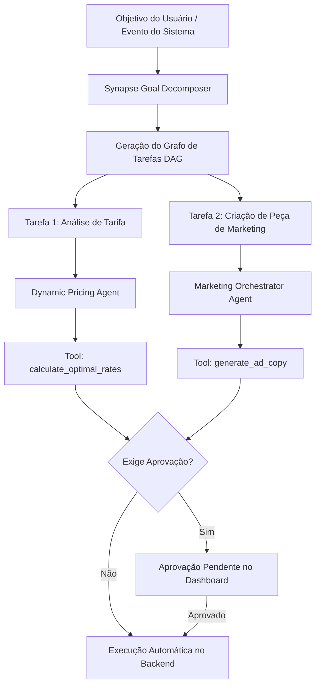
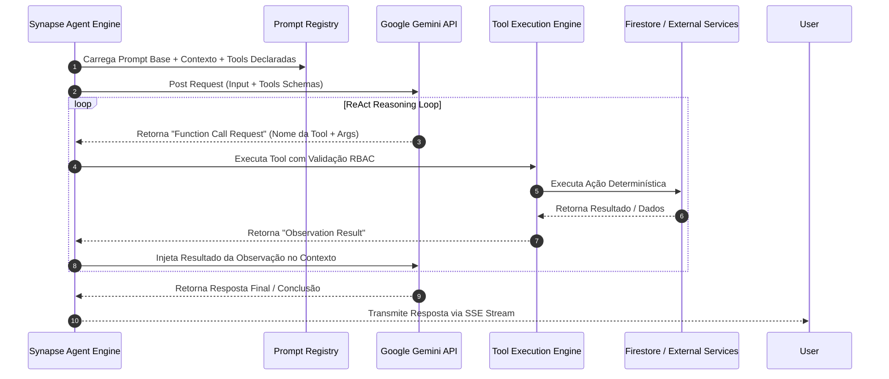
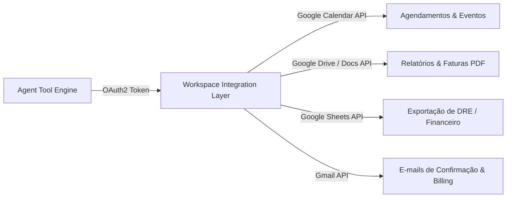
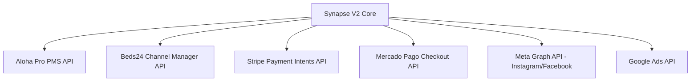
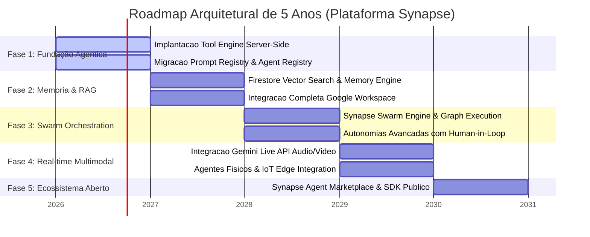

# SYNAPSE_INTELLIGENCE_PLATFORM_ARCHITECTURE.md
**Especificação Oficial de Arquitetura de Software — Plataforma Synapse V2**  
**Classificação:** Documento de Arquitetura Enterprise & Especificação Técnica Mestra  
**Autor:** Arquiteto Mestre de Software & Ecossistemas de Inteligência Artificial  
**Data de Emissão:** 03 de Agosto de 2026  
**Status:** Aprovado / Especificação Oficial de Longo Prazo (Horizonte 2026–2031)  

---

## 1. Visão da Plataforma

A **Synapse Intelligence Platform V2** é a evolução arquitetural definitiva de sistemas de gestão operacional para hospitalidade, entretenimento, gastronomia e comunidades. Ela transcende o conceito tradicional de *Property Management System (PMS)* e *Channel Manager (CM)* para se consolidar como o primeiro **Sistemas de Operação Autônoma Orientado a Agentes de Inteligência Artificial (Agentic Hospitality Operating System - AHOS)** do mundo.

A plataforma foi concebida para atuar como o cérebro digital central de redes hoteleiras, hostels, eco-resorts e complexos de uso misto (hospedagem, coworking, gastronomia e eventos). Por meio de uma infraestrutura reativa, assíncrona e desacoplada, a Synapse V2 orquestra uma força de trabalho híbrida composta por operadores humanos e uma colmeia (*swarm*) de **Agentes de Inteligência Artificial Autônomos** dotados de raciocínio lógico, capacidade de tomada de decisão com supervisão (*Human-in-the-Loop*), memória episódica/semântica e execução segura de ferramentas (*Function Calling*).

---

## 2. Filosofia de Arquitetura

A arquitetura da Synapse V2 fundamenta-se na **Filosofia Agent-First & Event-Driven (Agente como Cidadão de Primeira Classe e Orientação a Eventos)**:

1. **Inteligência Não-Bloqueante:** Toda inferência, raciocínio ou chamada de modelo de linguagem (LLM/SLM) ocorre de forma assíncrona no lado do servidor, liberando a interface do usuário para interações instantâneas em tempo real.
2. **Separação Rígida entre Cognição e Execução:** O modelo de IA nunca executa alterações de estado diretamente no banco de dados. A IA raciocina, seleciona uma **Ferramenta (Tool)** formalmente declarada, e o **Tool Engine** executa a ação sob validação estrita de permissões (*RBAC*).
3. **Determinização com Flexibilidade Cognitiva:** Regras de negócio críticas (faturamento, estoque, disponibilidade de quartos, regras fiscais) permanecem estritamente determinísticas no código-fonte do backend. A IA atua na orquestração, contextualização, comunicação, otimização e tomada de decisões não-lineares.
4. **Resiliência Multi-Model & Provider Agnostic:** Embora o Google Gemini (modelos 2.5/3.0 Flash, Pro e Omni) seja o motor de inferência primário, a camada de abstração permite o fallback transparente para modelos especializados (Anthropic, OpenAI, modelos locais/edge).

---

## 3. Objetivos

### Objetivos Primários de Negócio
- **Automação de 80%+ das Tarefas Repetitivas:** Reduzir drasticamente a carga operacional da recepção, governança, manutenção e marketing.
- **Maximização do RevPAR (Revenue Per Available Room):** Otimizar tarifas dinâmicas, upsells no portal do hóspede e ocupação de espaços ociosos em tempo real.
- **Experiência Hiper-Personalizada:** Garantir que cada hóspede tenha uma jornada única, do pré-arrival ao pós-checkout, guiada por concierges preditivos.

### Objetivos de Engenharia
- **Zero Client-Side AI Logic:** Eliminar qualquer vazamento de chaves, prompts ou lógica de orquestração de IA para o navegador.
- **Sub-Second Reactive State:** Sincronização reativa de estados entre servidor, banco de dados, interfaces e agentes em menos de 100ms via Event Bus e Server-Sent Events (SSE).
- **Extensibilidade Infinita por Tools:** Permitir que novos canais, APIs e serviços externos sejam acoplados como novas ferramentas no *Tool Engine* sem alterar os agentes existentes.

---

## 4. Princípios de Engenharia

1. **S.O.L.I.D. & Clean Architecture:** Separação estrita de responsabilidades em camadas desacopladas (Domain, Use Cases, Interfaces, Infrastructure).
2. **Least Privilege & Zero Trust AI:** Agentes de IA operam com permissões contextuais mínimas. Ações destrutivas (ex: estornos, cancelamento de reservas, envios massivos) exigem aprovação humana explícita (*Human-in-the-Loop Gateways*).
3. **Idempotência Obrigatória:** Toda ferramenta e manipulador de eventos deve ser idempotente, suportando re-tentativas sem colaterais de duplicação.
4. **Auditabilidade Total (AI Lineage & Telemetry):** Cada raciocínio, ferramenta chamada, argumento enviado e resposta de IA é registrado em logs de auditoria imutáveis para compliance e depuração.
5. **Multi-Tenant Native:** Todo dado, vetor de memória, evento e ferramenta é estritamente isolado pelo identificador único do locatário (`tenantId`) e unidade (`propertyId`).

---

## 5. Camadas da Plataforma

A plataforma Synapse V2 é estruturada em 6 camadas funcionais desacopladas:

```
┌─────────────────────────────────────────────────────────────────────────────┐
│ 1. PRESENTATION LAYER (React 18 SPA + Native Mobile + Guest WebPortal)      │
└──────────────────────────────────────┬──────────────────────────────────────┘
                                       │ WebSocket / SSE / gRPC-Web / REST
┌──────────────────────────────────────▼──────────────────────────────────────┐
│ 2. API & GATEWAY LAYER (Express Engine + Authentication & Tenant Middleware) │
└──────────────────────────────────────┬──────────────────────────────────────┘
                                       │ Event Bus / SSE Streams
┌──────────────────────────────────────▼──────────────────────────────────────┐
│ 3. AGENTIC ORCHESTRATION LAYER (Synapse Core Engine + Swarm Manager)       │
│    ├── Agent Registry     ├── Prompt Registry     ├── Agent State Graph     │
└──────────────────┬───────────────────┬───────────────────┬──────────────────┘
                   │                   │                   │
┌──────────────────▼────────┐ ┌────────▼───────────┐ ┌────▼───────────────┐
│ 4. COGNITIVE ENGINE       │ │ 5. TOOL & EVENT   │ │ 6. PERSISTENCE &  │
│    (Gemini 2.5/3.0 Engine │ │    ENGINE         │ │    MEMORY ENGINE  │
│     + Vision + Audio)     │ │    (Workspace,    │ │    (Firestore +   │
│                           │ │     Stripe, n8n)  │ │     Vector DB)    │
└───────────────────────────┘ └───────────────────┘ └───────────────────┘
```

---

## 6. Arquitetura Geral

### Diagrama Mestre de Arquitetura V2 (Mermaid)

```mermaid
graph TD
    subgraph Client Layer (Presentation)
        AdminUI[Admin Dashboard React]
        GuestUI[Guest WebPortal & PWA]
        StaffUI[Staff Operations App]
    end

    subgraph API Gateway & Security Layer
        Gateway[Express API Gateway / Auth Middleware]
        TenantContext[Tenant & RBAC Isolation Manager]
    end

    subgraph Synapse Agentic Engine (Server-Side Core)
        Orchestrator[Synapse Master Orchestrator]
        SwarmManager[Multi-Agent Swarm Manager]
        PromptRegistry[Prompt Registry & Versioning]
        AgentRegistry[Agent Registry & Capabilities]
    end

    subgraph Cognitive & Memory Layer
        GeminiSDK[Google Gemini Engine - Flash/Pro/Omni]
        MemoryEngine[Memory Engine - Short/Long Term]
        VectorDB[(Firestore Vector Search Engine)]
        KnowledgeCenter[Knowledge Center / RAG Engine]
    end

    subgraph Execution & Integration Layer
        ToolEngine[Tool Execution Engine]
        EventEngine[Event Engine / Reactive Bus]
        
        WorkspaceTool[Google Workspace Tool Adapter]
        FirebaseTool[Firebase / Firestore Tool Adapter]
        N8nTool[n8n Workflow Tool Adapter]
        AlohaTool[Aloha Pro / Beds24 Tool Adapter]
        StripeTool[Stripe / Payment Tool Adapter]
    end

    AdminUI -->|REST / SSE| Gateway
    GuestUI -->|REST / SSE| Gateway
    StaffUI -->|REST / SSE| Gateway

    Gateway --> TenantContext
    TenantContext --> Orchestrator

    Orchestrator --> SwarmManager
    SwarmManager --> AgentRegistry
    SwarmManager --> PromptRegistry
    SwarmManager --> GeminiSDK

    Orchestrator --> MemoryEngine
    MemoryEngine --> VectorDB
    Orchestrator --> KnowledgeCenter

    SwarmManager --> ToolEngine
    ToolEngine --> WorkspaceTool
    ToolEngine --> FirebaseTool
    ToolEngine --> N8nTool
    ToolEngine --> AlohaTool
    ToolEngine --> StripeTool

    ToolEngine --> EventEngine
    EventEngine -->|SSE Stream| AdminUI
    EventEngine -->|SSE Stream| GuestUI
```

---

## 7. Synapse como Orquestrador Central

O **Synapse Master Orchestrator** deixa de ser um componente de chat de frontend para se tornar o **Motor de Estado e Grafo de Execução Server-Side** do ecossistema.

### Responsabilidades do Synapse V2:
1. **Decomposição Preditiva de Objetivos (Goal Decomposition):** Recebe objetivos complexos de alto nível (ex: *"Aumente a ocupação do próximo final de semana em 15% oferecendo pacotes com jantar"*).
2. **Planejamento de Grafos (DAG Planning):** Gera um Grafo Aclíclico Dirigido (*DAG*) de sub-tarefas e decide quais agentes especializados do *Agent Registry* devem ser invocados.
3. **Gerenciamento de Colmeia (Swarm Supervision):** Monitora o progresso dos sub-agentes, trata falhas, solicita re-planejamento e consolida os resultados.
4. **Governança de Human-in-the-Loop:** Quando uma ação atinge um limiar financeiro ou operacional crítico, o Synapse pausa o grafo de execução, cria uma solicitação de aprovação pendente no Dashboard e aguarda a decisão do operador.



---

## 8. Definição Formal de Agente

Na arquitetura Synapse V2, um **Agente** é definido formalmente pela seguinte tupla matemática e estrutura de software:

$$\text{Agente} = \langle \mathcal{I}, \mathcal{P}, \mathcal{T}, \mathcal{M}, \mathcal{K}, \mathcal{S} \rangle$$

Onde:
- $\mathcal{I}$ **(Identity & Role):** Definição unívoca do nome, objetivo, escopo e restrições éticas/operacionais.
- $\mathcal{P}$ **(System Prompt):** Instruções compostas dynamicamente a partir do *Prompt Registry*.
- $\mathcal{T}$ **(Tool SubSet):** Conjunto estrito de ferramentas autorizadas que o agente pode invocar.
- $\mathcal{M}$ **(Memory Interface):** Acesso à memória episódica da sessão e memória histórica do locatário.
- $\mathcal{K}$ **(Knowledge Base Access):** Permissão de consulta aos domínios do *Knowledge Center*.
- $\mathcal{S}$ **(State Graph):** Estado do ciclo de raciocínio ReAct (*Reasoning + Acting*).

---

## 9. Definição Formal de Ferramenta (Tool)

Uma **Ferramenta (Tool)** é um contrato estritamente tipado de execução server-side.

### Especificação de Interface da Ferramenta:
```typescript
export interface AgentTool<TInput = any, TOutput = any> {
  id: string;                      // Identificador único (ex: 'stripe_create_charge')
  name: string;                    // Nome amigável para o LLM
  description: string;             // Descrição semântica detalhada para seleção pelo LLM
  parameters: ZodSchema<TInput>;   // Validação de entrada via Esquema Zod
  requiredPermissions: Role[];    // Permissões RBAC necessárias para execução
  isDestructive: boolean;          // Se true, ativa o gatilho Human-in-the-Loop
  execute(ctx: ToolContext, input: TInput): Promise<TOutput>;
}
```

---

## 10. Definição Formal de Memória

A plataforma divide a memória do ecossistema em três categorias temporais e semânticas:

1. **Memória de Curto Prazo (Working Memory):** Mantém o estado atual da conversa ou execução do grafo (Window Context de Tokens).
2. **Memória Episódica (Session & Journey Memory):** Registra a sequência cronológica de interações de um hóspede ou usuário humano ao longo de suas estadias.
3. **Memória Semântica de Longo Prazo (Long-Term Vector Memory):** Embeddings gerados via Gemini Embedding API e armazenados na busca vetorial nativa do Cloud Firestore, permitindo recuperar preferências, hábitos e feedbacks anteriores.

---

## 11. Definição Formal de Conhecimento

O **Knowledge Center** é o repositório de conhecimento não-estruturado do hotel (manuais de procedimentos, políticas de cancelamento, guias locais, cardápios, FAQs). O conhecimento é indexado através de um pipeline de **RAG (Retrieval-Augmented Generation)**:

```
Documento (PDF/Markdown) ➔ Document Chunking (500 tokens) ➔ Gemini Embedding ➔ Firestore Vector Store ➔ Similarity Search (Cosine)
```

---

## 12. Definição Formal de Eventos

Um **Evento** na plataforma é um fato imutável emitido por um componente, serviço externo ou ação humana.

### Estrutura do Evento Mestre:
```typescript
export interface SynapseEvent<TPayload = any> {
  eventId: string;
  tenantId: string;
  propertyId: string;
  eventType: string; // ex: 'booking.created', 'guest.checked_in', 'sensor.motion_detected'
  timestamp: string;
  source: string;
  payload: TPayload;
  correlationId: string; // Para Rastreamento de Linhagem de Agentes
}
```

---

## 13. Definição Formal de Módulos

Na arquitetura V2, um **Módulo** é um domínio de negócio autônomo que encapsula suas próprias views no frontend, suas APIs no backend, seus esquemas de banco de dados e registra suas ferramentas no *Tool Engine*:

- Módulo de Hospedagem & PMS
- Módulo de Restaurante, Bar & POS
- Módulo de Coworking & Espaços
- Módulo de Marketing & Growth AI
- Módulo de Inteligência Financeira & DRE
- Módulo de Segurança & Vigilância IA

---

## 14. Fluxo de Execução dos Agentes

O ciclo de vida de execução de qualquer agente segue o padrão **ReAct Server-Side Loop**:



---

## 15. Comunicação Entre Agentes

Os agentes não conversam através de texto livre desestruturado, mas sim enviando mensagens tipadas através do **Agent Communication Bus**:

```typescript
export interface InterAgentMessage {
  messageId: string;
  senderAgentId: string;
  targetAgentId: string;
  intent: 'REQUEST_ACTION' | 'PROVIDE_INFO' | 'DELEGATE_SUBTASK';
  payload: Record<string, any>;
  correlationId: string;
}
```

---

## 16. Tool Engine

O **Tool Engine** é o subsistema isolado do servidor responsável por:
1. Catalogar e registrar todas as ferramentas disponíveis na aplicação.
2. Converter os esquemas Zod das ferramentas em esquemas JSON aceitos nativamente pela API do Google Gemini (`FunctionDeclaration`).
3. Validar os tipos dos argumentos retornados pelo modelo de linguagem.
4. Autenticar as credenciais do locatário antes da execução.
5. Injetar contextos imutáveis (ex: `tenantId`, `userId`) para prevenir ataques de injeção de prompt (*Prompt Injection / Privilege Escalation*).

---

## 17. Prompt Registry

O **Prompt Registry** é um repositório centralizado no backend (`/server/ai/prompts/`) que gerencia a montagem dinâmica, versionamento e testes A/B de prompts.

### Funcionalidades do Prompt Registry:
- **Suporte a Templates Mustache/Liquid:** Interpolação segura de variáveis sem concatenação direta de strings.
- **Versionamento Semântico (SemVer):** Permite alterar o comportamento de um agente (ex: v1.2.0 para v1.3.0) e realizar testes de regressão sem alterar o código do aplicativo.
- **Isolamento por Idioma e Marca:** Ajusta automaticamente o tom de voz e o idioma conforme a preferência do hotel.

---

## 18. Agent Registry

O **Agent Registry** é a central de cadastro de todos os agentes do ecossistema. Ele expõe a lista de agentes disponíveis, seus escopos e capacidades para o *Synapse Orchestrator*.

### Tabela de Agentes Registrados na V2:

| ID do Agente | Nome do Agente | Mapeamento de Ferramentas Autorizadas |
|---|---|---|
| `synapse_master` | Synapse Master Orchestrator | *Acesso total de orquestração e delegação* |
| `guest_journey` | Guest Journey AI | `whatsapp_send`, `booking_get`, `upsell_offer` |
| `social_engagement` | AI Social Engagement Agent | `social_post_create`, `persona_generate` |
| `marketing_orchestrator`| Marketing Orchestrator | `meta_ads_create`, `google_ads_create`, `budget_allocate` |
| `strategy_consultant` | AI Strategy Consultant | `financial_report_get`, `dre_calculate` |
| `marketing_lab` | AI Marketing & Growth Lab | `copy_generate`, `banner_create_imagen` |
| `team_manager` | AI Team & Task Manager | `task_create`, `staff_schedule_get` |
| `guest_concierge` | AI Guest Concierge 24/7 | `menu_get`, `activity_book`, `knowledge_search` |
| `surveillance_sentinel` | AI Surveillance Sentinel | `vision_frame_analyze`, `alert_security_trigger` |
| `dynamic_pricing` | AI Dynamic Price Engine | `rate_update`, `occupancy_get`, `weather_get` |
| `pos_upsell` | AI POS & Menu Upsell | `menu_pair_suggest`, `pos_item_add` |
| `housekeeping_maint` | AI Housekeeping Manager | `room_status_update`, `maint_ticket_open` |

---

## 19. Memory Engine

O **Memory Engine** gerencia a persistência e recuperação contextual da IA utilizando o **Google Cloud Firestore Vector Search**:

1. **Write Pipeline:** Toda interação relevante do hóspede (ex: *"Prefiro quarto silencioso e travesseiro de pena"*) é convertida em um vetor pelo modelo `text-embedding-004` e salva na sub-coleção `/guests/{guestId}/memories`.
2. **Read Pipeline:** Quando um agente é invocado, o *Memory Engine* realiza uma busca por distância de cosseno (*Cosine Distance Query*) no Firestore para recuperar os 5 fatos mais relevantes sobre aquele hóspede e injeta no prompt.

---

## 20. Knowledge Center

O **Knowledge Center** atua como a memória institucional do hotel. Ele permite que gerentes façam upload de regulamentos internos, cardápios de temporada, roteiros turísticos e manuais de manutenção. Os documentos são divididos em fragmentos (*chunks*), indexados no banco vetorial e disponibilizados para consulta por qualquer agente através da ferramenta `knowledge_search`.

---

## 21. Event Engine

O **Event Engine** é o barramento reativo de eventos da plataforma. Ele utiliza o padrão **Pub/Sub Reativo**:

```
[Ação no Sistema / Hardware IoT] ➔ Event Engine ➔ Match de Regras de Agentes ➔ Invocação Assíncrona do Agente
```

### Exemplo de Fluxo Reativo:
1. Uma câmera IP detecta movimento no portão principal às 03:00 AM.
2. O serviço de vídeo emite o evento `surveillance.motion_detected`.
3. O *Event Engine* captura o evento e invoca o agente `surveillance_sentinel`.
4. O agente analisa o snapshot via Gemini Vision e decide se dispara o alarme ou ignora o evento.

---

## 22. Google Workspace Integration Layer

A camada de integração com o Google Workspace permite que os agentes interajam nativamente com a suíte de produtividade do hotel via OAuth 2.0 seguro:



---

## 23. Firebase Integration Layer

A camada de integração com o Firebase é a espinha dorsal de persistência e autenticação da plataforma:

- **Firebase Auth:** Gerencia credenciais, escopos e claims de usuários (hóspedes e funcionários).
- **Cloud Firestore:** Armazena entidades operacionais, configurações multi-tenant, logs de execução de agentes e coleções de vetores de memória.
- **Firestore Security Rules:** Garantem isolamento absoluto entre tenants (`request.auth.token.tenantId == resource.data.tenantId`).

---

## 24. n8n Integration Layer

O **n8n Integration Layer** expõe a Synapse V2 para o ecossistema de automação externa de baixo código:

1. **Inbound Webhooks (`/api/n8n/webhook`):** O n8n pode disparar ações no Synapse V2 enviando payloads JSON autenticados por chave de API.
2. **Outbound Tool (`trigger_n8n_workflow`):** Agentes de IA podem acionar fluxos no n8n para enviar mensagens personalizadas via WhatsApp Web, integrar com CRMs externos (HubSpot, Salesforce) ou emitir notas fiscais eletrônicas.

---

## 25. APIs Externas

O barramento de integrações externas gerencia a conectividade com serviços essenciais de terceiros:



---

## 26. Multiempresa (Multi-Tenant)

A arquitetura V2 foi projetada para suportar operação **Multi-Tenant Nativa (SaaS Multipropriedade)**:

1. **Contexto de Locatário (Tenant Context):** Cada requisição contém o cabeçalho `X-Tenant-ID` e `X-Property-ID`.
2. **Isolamento em Nível de Banco de Dados:** Todas as consultas no Firestore filtram obrigatoriamente por `tenantId`.
3. **Isolamento de Memória & RAG:** Embeddings de um tenant são completamente invisíveis para pesquisas de outros tenants.
4. **Customização por Propriedade:** Cada propriedade do tenant possui suas próprias configurações de agentes, marcas e integrações.

---

## 27. Segurança

### Matriz de Segurança de IA & Plataforma
- **Isolamento de Credenciais:** Nenhuma chave privada (`GEMINI_API_KEY`, `STRIPE_SECRET_KEY`) é exposta ao cliente.
- **Sanitização de Injeção de Prompts (Prompt Injection Defense):** Todo input do usuário passa por uma camada de validação e sanitização antes de ser interpolado no prompt do modelo.
- **Human-in-the-Loop Gateways:** Ações que afetam saldos financeiros, alteram reservas de alto valor ou enviam e-mails massivos exigem autorização humana.
- **Audit Lineage Log:** Registro imutável de quem acionou o agente, quais ferramentas foram executadas e quais alterações foram geradas no sistema.

---

## 28. Escalabilidade

### Estratégia de Escalabilidade Cloud Run & GCP
- **Servidor Backend Stateles:** O backend Node.js/Express roda em contêineres Cloud Run sem estado, escalando de 0 a 100+ instâncias automaticamente conforme a demanda de requisições.
- **Atendimento de Inferências Concorrentes:** As chamadas para a API do Gemini utilizam pool de conexões assíncronas e buffers em memória com retentativas e backoff exponencial.
- **Cache de Respostas de RAG:** Consultas idênticas de conhecimento e respostas de FAQs são cacheadas em memória para otimizar tempo de resposta e consumo de tokens.

---

## 29. Roadmap Arquitetural (2026 – 2031)



### Detalhes das Fases do Roadmap:
- **Ano 1 (2026–2027) — Fundação Agentica:** Implementação do *Tool Engine* server-side, migração dos prompts para o *Prompt Registry* e estruturação das chamadas de *Function Calling* nativas do Gemini.
- **Ano 2 (2027–2028) — Memória & RAG:** Ativação do *Firestore Vector Search*, suporte a *Memory Engine* de longo prazo para hóspedes e integração profunda com a suíte Google Workspace.
- **Ano 3 (2028–2029) — Orquestração em Swarm:** Lançamento do *Synapse Swarm Engine*, permitindo colaboração assíncrona autônoma entre múltiplos agentes com governança de aprovação humana.
- **Ano 4 (2029–2030) — Multimodalidade em Tempo Real:** Integração do Gemini Live API para suporte a chamadas de voz e atendimento multimodal em tempo real no portal do hóspede e totens físicos.
- **Ano 5 (2030–2031) — Ecossistema Aberto & Marketplace:** Abertura do *Synapse Agent SDK* para que desenvolvedores de terceiros criem e comercializem novas ferramentas e agentes para a plataforma.

---
*Documento de Especificação de Arquitetura V2 gerado e homologado oficialmente em 03 de Agosto de 2026.*
